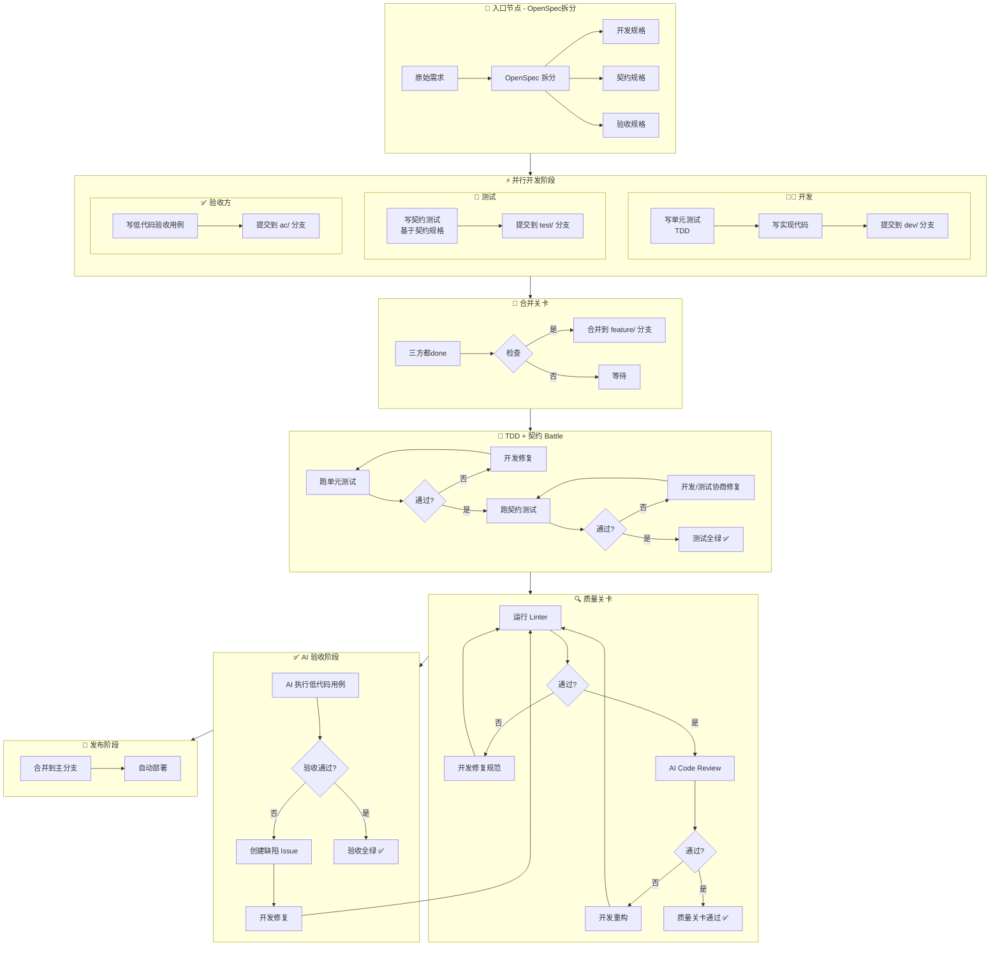
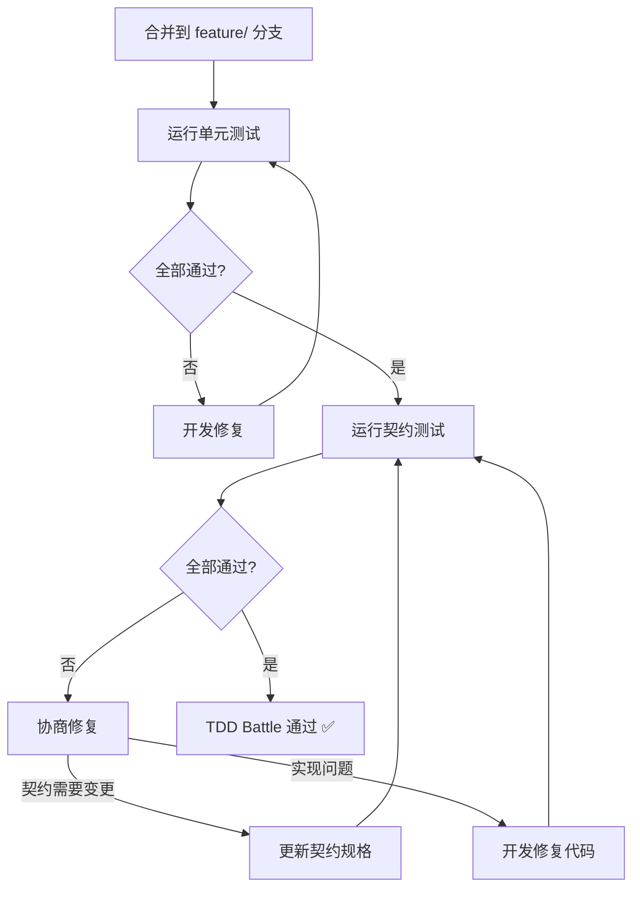
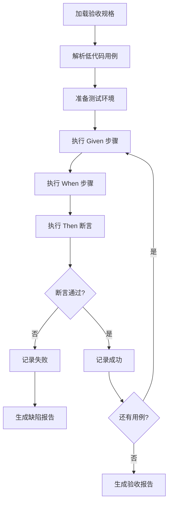

# AI 驱动自动化测试方案

> 基于 OpenSpec + TDD + CDD + AI 验收的完整研发工作流

## 核心原则

**三角色，三职责，零重叠：**

| 角色 | 负责内容 | 测试类型 | 视角 |
|------|---------|---------|------|
| **开发** | 功能代码 + 单元测试 | 白盒测试 | 实现逻辑正确 |
| **测试** | 契约测试 | 灰盒测试 | 接口符合契约 |
| **验收方** | 验收用例 | 黑盒测试 | 业务场景通过 |

---

## 整体架构



---

## 阶段详解

### Phase 0: 接口契约设计（前置阻塞）

**责任方**：后端主导，前端+测试参与评审  
**阻塞性**：✅ 必须先完成，否则无法进入并行开发

#### 输出物

```yaml
# contract.spec.yaml - 契约规格
api_version: "v1"
req_id: "REQ-01"

endpoints:
  - id: "API-01"
    path: "/api/v1/orders"
    method: "POST"
    description: "创建订单"
    
    request:
      content_type: "application/json"
      schema:
        type: object
        properties:
          product_id:
            type: string
            required: true
          quantity:
            type: integer
            minimum: 1
            maximum: 99
    
    responses:
      "200":
        description: "创建成功"
        schema:
          type: object
          properties:
            order_id:
              type: string
            status:
              type: string
              enum: ["created", "paid"]
      "400":
        description: "参数错误"

    examples:
      success:
        request: { "product_id": "P001", "quantity": 2 }
        response: { "order_id": "O123", "status": "created" }
```

#### 评审检查点

- [ ] 前端确认：接口能满足UI需求
- [ ] 后端确认：接口能实现
- [ ] 测试确认：契约可测试、边界清晰

---

### Phase 1: 入口节点 - OpenSpec 拆分

#### 1.1 输入
- 原始需求文档（PRD）
- 业务规则说明
- 接口契约规格（Phase 0 产出）

#### 1.2 OpenSpec 拆分输出

| 输出物 | 文件名格式 | 内容 | 责任人 |
|--------|-----------|------|--------|
| 开发规格 | `{req-id}.dev.spec.md` | 功能实现细节、数据模型、内部逻辑 | AI Agent |
| 契约规格 | `{req-id}.contract.spec.yaml` | API 定义、请求/响应 Schema（Phase 0） | AI Agent |
| 验收规格 | `{req-id}.ac.spec.yaml` | 低代码验收用例（Given/When/Then） | AI Agent |

#### 1.3 文件模板

**开发规格模板** (`{req-id}.dev.spec.md`):
```markdown
# DEV-SPEC: {需求名称}

## 功能清单
- [ ] FR-01: xxx
- [ ] FR-02: xxx

## 数据模型
```go
type Order struct {
    ID string
    // ...
}
```

## 实现注意事项
1. 使用分布式锁防止并发问题
2. 订单状态机必须完整
```

**验收规格模板** (`{req-id}.ac.spec.yaml`):
```yaml
# AC-SPEC: {需求名称}
version: "1.0"
req_id: "REQ-01"

acceptance_criteria:
  - id: "AC-01"
    title: "即时支付模式完整流程"
    given:
      - 商家已开启门店扫码点餐
    when:
      - action: scan_qr
        params: { table_id: "T01" }
      - action: submit_order
      - action: pay_order
    then:
      - assert: order.status == "paid"
      - assert: erp.sales_invoice exists
```

---

### Phase 2: 并行开发阶段

#### 2.1 分支策略

```
main
  └── feature/REQ-01-member-dine-in
       ├── dev/REQ-01          # 开发分支（开发负责）
       ├── test/REQ-01         # 测试分支（测试负责）
       └── ac/REQ-01           # 验收分支（验收方负责）
```

#### 2.2 各分支职责（明确边界）

| 分支 | 负责人 | 具体内容 | 归档路径 |
|------|--------|----------|---------|
| `dev/{req-id}` | **开发** | 功能代码 + **单元测试** | `src/{module}/` + `tests/unit/` |
| `test/{req-id}` | **测试** | **契约测试**（仅契约测试） | `tests/contract/` |
| `ac/{req-id}` | **验收方** | 低代码验收用例 | `tests/acceptance/cases/` |

#### 2.3 单元测试（开发写 - TDD方式）

```go
// tests/unit/order/calc_test.go
// 开发负责：测试函数内部逻辑

func TestCalculateTotal_WithDiscount(t *testing.T) {
    items := []Item{{Price: 100, Qty: 2}}
    discount := 0.1
    
    total := CalculateTotal(items, discount)
    
    assert.Equal(t, 180.0, total) // 200 * 0.9
}

func TestCalculateTotal_InvalidDiscount(t *testing.T) {
    items := []Item{{Price: 100, Qty: 1}}
    discount := 1.5 // 无效折扣
    
    _, err := CalculateTotal(items, discount)
    
    assert.Error(t, err)
}
```

**单元测试关注点**：
- 函数内部逻辑正确
- 边界条件处理
- 错误处理路径
- 并发安全性

#### 2.4 契约测试（测试写 - 基于契约规格）

```go
// tests/contract/order_api_test.go
// 测试负责：验证API是否符合契约规格

func TestCreateOrder_Contract(t *testing.T) {
    req := CreateOrderRequest{
        ProductID: "P001",
        Quantity: 2,
    }
    
    resp, err := CallCreateOrderAPI(req)
    
    // 验证响应符合契约规格定义的schema
    assert.NotEmpty(t, resp.OrderID)  // 契约：必须有order_id
    assert.Contains(t, []string{"created", "paid"}, resp.Status)  // 契约：状态枚举
}

func TestCreateOrder_InvalidParams(t *testing.T) {
    req := CreateOrderRequest{
        ProductID: "",  // 空ID
        Quantity: 2,
    }
    
    resp, err := CallCreateOrderAPI(req)
    
    // 契约：400错误
    assert.Equal(t, 400, resp.StatusCode)
    assert.NotEmpty(t, resp.ErrorMessage)  // 契约：必须有错误信息
}
```

**契约测试关注点**：
- 请求格式是否符合契约
- 响应格式是否符合契约
- 状态码是否正确
- 边界值处理（契约规定的边界）

#### 2.5 低代码验收用例（验收方写）

```yaml
# tests/acceptance/cases/REQ-01.yaml
version: "1.0"
req_id: "REQ-01"

acceptance_criteria:
  - id: "AC-01"
    title: "即时支付模式完整流程"
    given:
      - 商家已开启门店扫码点餐
    when:
      - action: scan_qr
        params: { table_id: "T01" }
      - action: select_product
        params: { product_id: "P01", qty: 2 }
      - action: submit_order
      - action: pay_order
        params: { method: "promptpay" }
    then:
      - assert: order.status == "paid"
      - assert: order.total_amount > 0
      - assert: erp.sales_invoice exists
      - assert: inventory.deducted == true
```

#### 2.6 完成标准

每个分支必须满足以下条件才能标记为 done：

```yaml
# .sisyphus/REQ-01/status.yaml
dev:
  status: done
  completed_at: "2026-04-06T10:00:00Z"
  commit_hash: "abc123"
  unit_test_coverage: "85%"  # 开发提供
  
test:
  status: done
  completed_at: "2026-04-06T11:00:00Z"
  commit_hash: "def456"
  contract_test_count: 12  # 测试提供
  
ac:
  status: done
  completed_at: "2026-04-06T12:00:00Z"
  commit_hash: "ghi789"
  acceptance_cases_count: 6  # 验收方提供
```

---

### Phase 3: TDD + 契约 Battle 阶段

#### 3.1 流程



#### 3.2 失败责任划分

| 失败类型 | 谁负责修 | 处理方式 |
|---------|---------|---------|
| **单元测试失败** | **开发** | 实现逻辑错误，开发自行修复 |
| **契约测试失败** | **开发/测试协商** | 实现不符契约 → 开发修；契约不合理 → 测试更新契约测试 |

#### 3.3 通过标准

- 单元测试覆盖率 ≥ 80%（开发保证）
- 契约测试全部通过（测试验证）
- 无 flaky test

---

### Phase 4: 质量关卡

#### 4.1 Linter 检查（开发负责修复）

```yaml
# .github/workflows/quality-gate.yml
jobs:
  lint:
    runs-on: ubuntu-latest
    steps:
      - uses: actions/checkout@v4
      
      - name: Run Go Linter
        run: golangci-lint run ./...
        
      - name: Run Semgrep
        run: semgrep --config=auto .
```

**失败 → 开发修复代码规范**

#### 4.2 AI Code Review（开发负责修复）

```yaml
jobs:
  ai-review:
    runs-on: ubuntu-latest
    steps:
      - uses: actions/checkout@v4
      
      - name: AI Code Review
        uses: sisyphus/ai-reviewer@v1
        with:
          spec_file: "specs/REQ-01.dev.spec.md"
          code_pattern: "src/**/*.go"
```

**失败 → 开发重构代码**

#### 4.3 质量关卡检查项

| 检查项 | 工具 | 通过标准 | 责任人 |
|--------|------|---------|--------|
| 代码格式 | gofmt / prettier | 无格式错误 | 开发 |
| 静态分析 | golangci-lint | 无 error | 开发 |
| 安全扫描 | Semgrep / Gosec | 无高危漏洞 | 开发 |
| 架构合规 | AI Reviewer | 符合设计规范 | 开发 |
| 代码复杂度 | gocyclo | 函数复杂度 < 15 | 开发 |

---

### Phase 5: AI 验收阶段

#### 5.1 验收执行流程



#### 5.2 验收失败处理

**责任方：开发修复**

```markdown
## 🔧 验收失败修复任务

**原始需求**: REQ-01  
**失败用例**: AC-04 拒单退款  
**创建时间**: 2026-04-06 14:05:00  
**优先级**: P0 (阻塞发布)

### 修复标准
- [ ] 修复业务逻辑
- [ ] 单元测试通过
- [ ] 契约测试通过
- [ ] Linter 通过
- [ ] AI Review 通过
- [ ] 重新验收通过
```

---

## 目录结构规范

```
sisyphus/
├── specs/                          # 需求规格
│   ├── REQ-01/
│   │   ├── dev.spec.md            # 开发规格
│   │   ├── contract.spec.yaml     # 契约规格
│   │   └── ac.spec.yaml           # 验收规格
│   └── REQ-02/
│       └── ...
│
├── src/                           # 源代码（开发维护）
│   ├── order/
│   ├── member/
│   └── ...
│
├── tests/
│   ├── unit/                      # 单元测试（开发写）
│   │   ├── order/
│   │   │   └── calc_test.go
│   │   └── ...
│   │
│   ├── contract/                  # 契约测试（测试写）
│   │   ├── order_api_test.go
│   │   └── mocks/
│   │
│   ├── acceptance/                # 验收测试（验收方写用例，AI执行）
│   │   ├── engine/               # 执行引擎
│   │   ├── actions/              # 动作定义
│   │   ├── assertions/           # 断言定义
│   │   └── cases/                # 用例文件
│   │       ├── REQ-01.yaml
│   │       └── ...
│   │
│   └── fixtures/                  # 测试数据
│
├── .github/
│   └── workflows/
│       ├── tdd-battle.yml        # TDD Battle 工作流
│       ├── quality-gate.yml      # 质量关卡工作流
│       └── ai-acceptance.yml     # AI 验收工作流
│
└── .sisyphus/                     # 状态追踪
    ├── REQ-01/
    │   └── status.yaml
    └── config.yaml
```

---

## 关键交互点（仅3处）

### 1. 契约规格评审（开始前）

**参与**：后端（主导）+ 前端 + 测试  
**目标**：确认契约可实现、可测试

### 2. 合并关卡（开发完成后）

**触发**：三方都标记 done  
**检查**：自动合并到 feature/ 分支

### 3. 验收失败（最后）

**处理**：创建Issue → 开发修复 → 重新跑质量关卡+验收

---

## 快速开始

```bash
# 1. 启动平台
make start

# 2. 创建新需求
make req-create REQ_ID=REQ-16 TITLE="新功能"

# 3. 运行 OpenSpec 拆分
make spec-split REQ_ID=REQ-16

# 4. 三方并行开发
make dev-start REQ_ID=REQ-16    # 开发
make test-start REQ_ID=REQ-16   # 测试
make ac-start REQ_ID=REQ-16     # 验收方

# 5. 标记完成
make dev-done REQ_ID=REQ-16     # 开发提交
make test-done REQ_ID=REQ-16    # 测试提交
make ac-done REQ_ID=REQ-16      # 验收方提交

# 6. 运行 TDD + 契约 Battle
make tdd-battle REQ_ID=REQ-16

# 7. 运行质量关卡
make quality-gate REQ_ID=REQ-16

# 8. 运行 AI 验收
make ai-acceptance REQ_ID=REQ-16

# 9. 发布
make release REQ_ID=REQ-16
```

---

## 总结

| 阶段 | 通过标准 |
|------|---------|
| 契约设计 | 前后端+测试三方确认 |
| 需求拆分 | 三份规格文档完整 |
| 并行开发 | 三方都标记 done |
| TDD Battle | 单元测试 ≥ 80%，契约测试全绿 |
| 质量关卡 | Linter + AI Review 通过 |
| AI 验收 | 所有 AC 用例通过 |
| 发布 | 合并到主分支，自动部署 |
