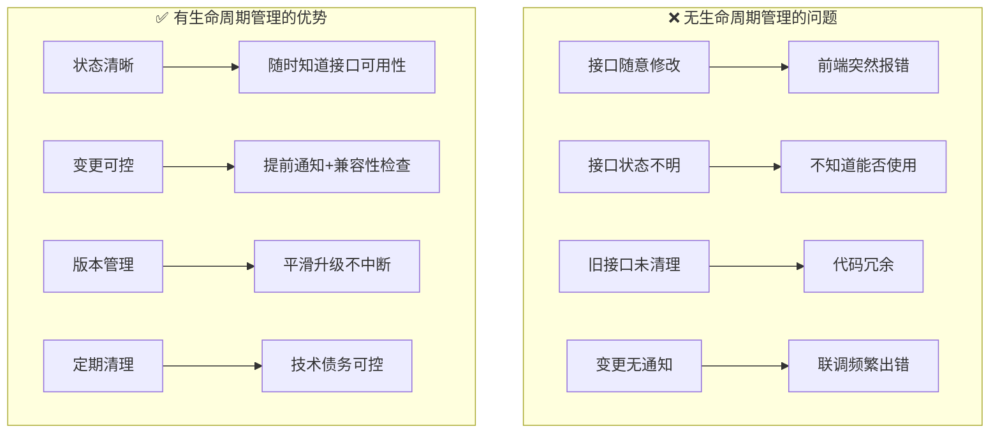
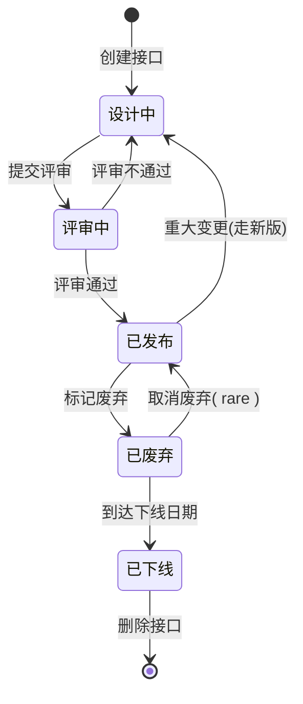
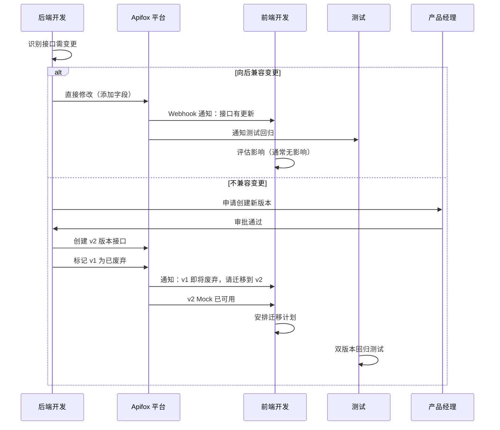
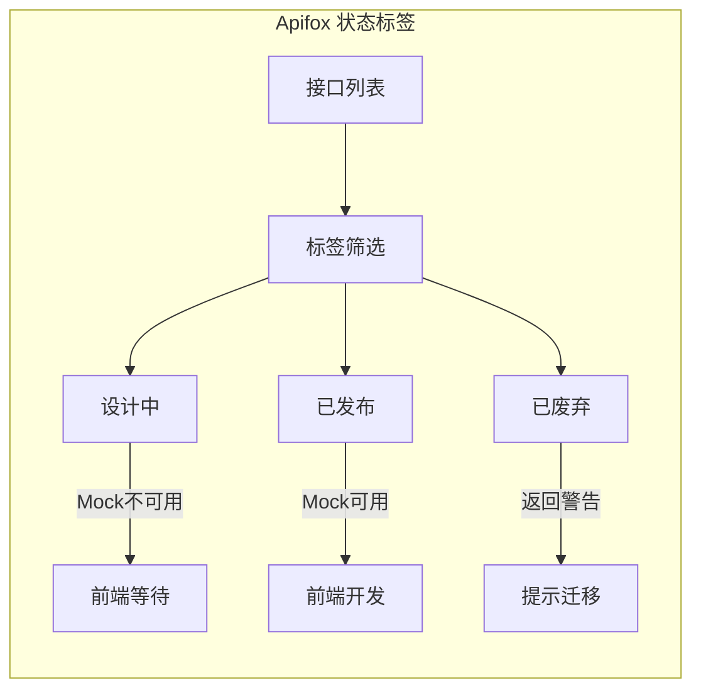
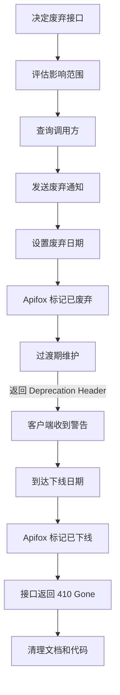
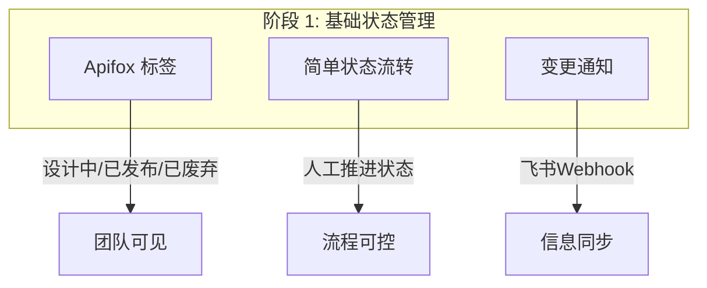
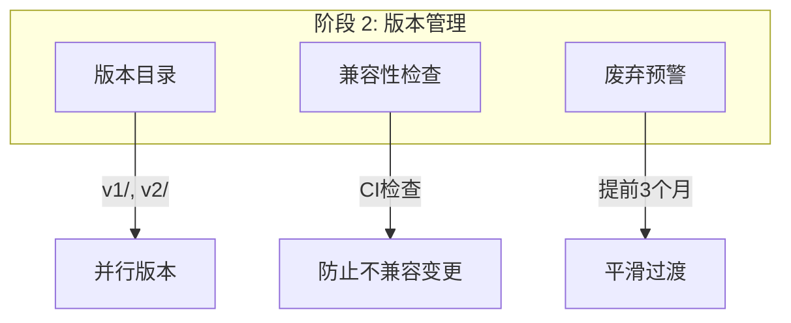
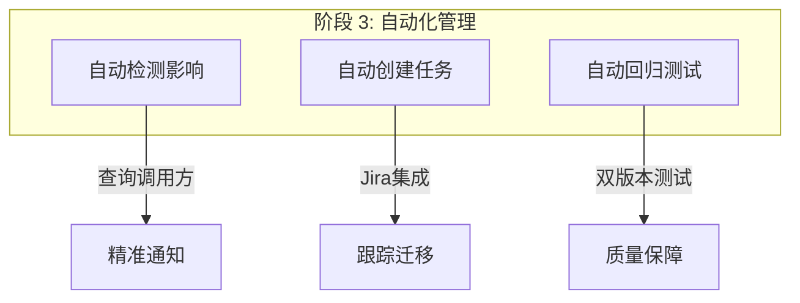
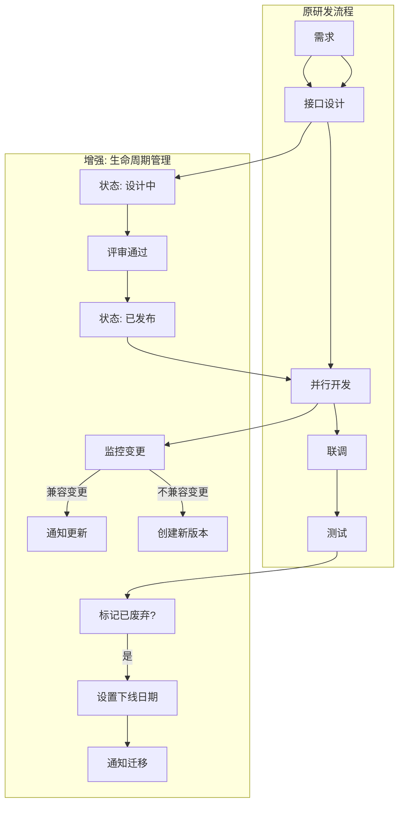

# API 生命周期管理

## 为什么需要生命周期管理



## API 生命周期状态流转



### 状态定义

| 状态 | 说明 | 可用性 | 使用场景 |
|------|------|--------|----------|
| **设计中** | 草稿状态，频繁修改 | ❌ 不可用 | 后端正在设计接口 |
| **评审中** | 等待前后端评审 | ⚠️ 临时可用 | 已完成功能设计，待确认 |
| **已发布** | 正式可用，稳定 | ✅ 可用 | 前后端已联调通过 |
| **已废弃** | 不再推荐使用 | ⚠️ 可用但警告 | 有新接口替代 |
| **已下线** | 完全不可用 | ❌ 不可用 | 已删除或返回 410 |

## 版本管理策略

```mermaid
flowchart TB
    subgraph 版本策略["API 版本策略"]
        V1[/v1/order/create] --> |运行中| V1_State[已发布]
        V2[/v2/order/create] --> |新增字段| V2_State[已发布]
        V3[/v3/order/create] --> |重大变更| V3_State[设计中]
        
        V1_State --> |6个月后| V1_Deprecated[已废弃]
        V1_Deprecated --> |3个月后| V1_Offline[已下线]
        
        V2_State --> V2_Current[当前主流版本]
    end
    
    subgraph 兼容性规则["兼容性规则"]
        C1[向后兼容] --> |允许| Add[添加字段]
        C1 --> |允许| Optional[新增可选参数]
        C1 --> |禁止| Remove[删除字段]
        C1 --> |禁止| Required[新增必填参数]
        
        C2[不兼容变更] --> |必须| NewVersion[创建新版本]
    end
```

### 版本控制规范

```yaml
# API 版本命名规范
版本格式: v{major}.{minor}
  - v1.0: 初始版本
  - v1.1: 向后兼容的功能增强
  - v2.0: 不兼容的重大变更

版本存活周期:
  - 主流版本: 至少支持 12 个月
  - 废弃预警: 下线前 3 个月通知
  - 并行运行: 新旧版本同时支持过渡期
```

## 变更管理流程



### 变更影响评估矩阵

| 变更类型 | 兼容性 | 是否需要新版本 | 通知范围 | 处理时限 |
|----------|--------|----------------|----------|----------|
| 添加响应字段 | ✅ 兼容 | ❌ 否 | 前端知晓 | 下次迭代 |
| 添加可选请求参数 | ✅ 兼容 | ❌ 否 | 前端知晓 | 下次迭代 |
| 修改字段含义 | ❌ 不兼容 | ✅ 是 | 全员通知 | 立即处理 |
| 删除字段 | ❌ 不兼容 | ✅ 是 | 全员通知 | 立即处理 |
| 新增必填参数 | ❌ 不兼容 | ✅ 是 | 全员通知 | 立即处理 |
| 修改错误码 | ⚠️ 可能不兼容 | ⚠️ 评估 | 测试+前端 | 2天内 |

## Apifox 中的生命周期管理

### 1. 状态标签管理



**Apifox 配置**:
- 使用「标签」功能标记状态：`设计中`、`已发布`、`已废弃`
- 使用「目录」管理版本：`v1/`、`v2/`
- 使用「版本」功能管理接口迭代

### 2. 变更通知机制

```yaml
# Apifox Webhook 配置
触发条件:
  - 接口状态变更: 设计中 → 已发布
  - 接口内容变更: 请求/响应 Schema 修改
  - 新增接口: 目录下新增接口
  - 接口废弃: 标记为已废弃

通知渠道:
  - 飞书群: @相关开发
  - 邮件: 接口变更摘要
  - Jira: 自动创建任务（重大变更）
```

### 3. 废弃与下线流程



**废弃通知模板**:
```markdown
🔔 接口废弃通知

接口: POST /v1/order/create
状态: 已废弃 → 将于 2024-06-01 下线
替代接口: POST /v2/order/create
影响范围: @前端团队 @小程序团队
迁移指南: [文档链接]

请尽快迁移，如有问题联系 @后端负责人
```

## 实施建议

### 阶段 1: 基础管理（当前即可实施）



**立即实施**:
1. 为所有接口打标签（状态）
2. 配置 Webhook 通知到飞书群
3. 团队约定：只有「已发布」接口才能用于开发

### 阶段 2: 版本管理（3个月后）



**实施要点**:
1. 新功能创建 v2 版本
2. v1 保持维护，标记废弃日期
3. CI 检查接口兼容性

### 阶段 3: 自动化（6个月后）



## 与研发流程的整合



## 工具配置示例

### Apifox 标签配置

```
标签体系:
├── 状态标签
│   ├── 设计中 (红色)
│   ├── 评审中 (黄色)
│   ├── 已发布 (绿色)
│   ├── 已废弃 (灰色)
│   └── 已下线 (删除线)
│
├── 版本标签
│   ├── v1.0
│   ├── v1.1
│   └── v2.0
│
└── 优先级标签
    ├── P0-阻塞
    ├── P1-重要
    └── P2-一般
```

### 自动化检查脚本

```bash
#!/bin/bash
# check-api-lifecycle.sh

# 检查是否有「设计中」的接口被使用
DESIGNING_APIS=$(apifox-cli list --status=设计中)
if [ -n "$DESIGNING_APIS" ]; then
    echo "⚠️ 警告: 以下接口状态为「设计中」，不应使用:"
    echo "$DESIGNING_APIS"
    exit 1
fi

# 检查是否有已废弃接口仍在代码中
DEPRECATED_APIS=$(grep -r "v1/order/create" src/ || true)
if [ -n "$DEPRECATED_APIS" ]; then
    echo "❌ 错误: 代码中仍在使用已废弃接口:"
    echo "$DEPRECATED_APIS"
    exit 1
fi

echo "✅ API 生命周期检查通过"
```

## 总结

| 维度 | 无生命周期管理 | 有生命周期管理 |
|------|----------------|----------------|
| 接口状态 | 混乱，不知道能否用 | 清晰，随时可查 |
| 变更影响 | 经常突发故障 | 提前通知，可控 |
| 版本混乱 | 多个版本共存，无规范 | 有序过渡，平滑升级 |
| 技术债务 | 旧接口堆积 | 定期清理 |
| 团队协作 | 频繁沟通确认 | 自助查询，减少沟通 |

**建议**: 从「基础状态管理」开始，逐步引入版本管理和自动化。
