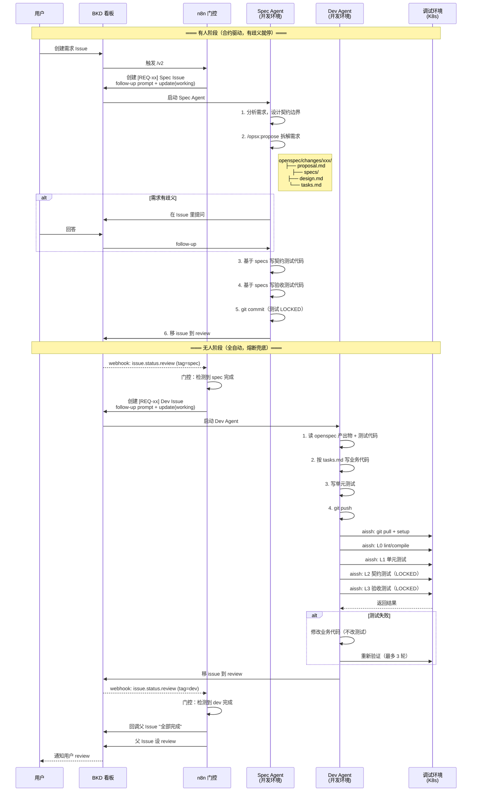
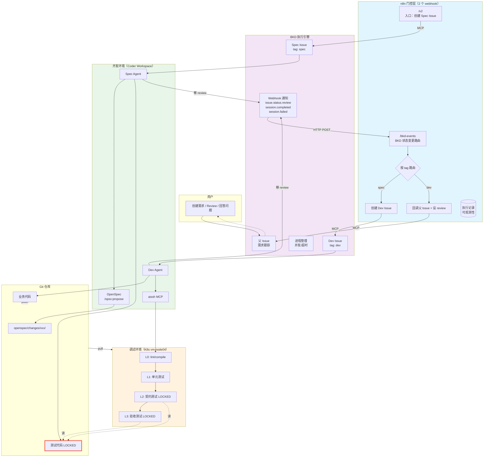
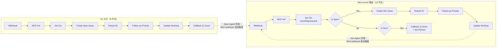

# V3 工作流全景

## 整体协作流程



## 系统组件图



## n8n 工作流内部



## 数据流

| 通道 | 用途 | 方向 |
|------|------|------|
| n8n webhook `/v2` | 入口触发 | 用户/BKD → n8n |
| BKD MCP (JSON-RPC) | n8n 创建/管理 Issue | n8n → BKD |
| BKD Webhook | Issue 状态变更通知 | BKD → n8n |
| OpenSpec `/opsx:propose` | 需求拆解 | Agent 内部 |
| git push/pull | 代码传输 | 开发环境 ↔ 调试环境 |
| aissh MCP | 远程控制调试环境 | 开发环境 → 调试环境 |
| BKD Issue 对话 | 可观测性 + 人机交互 | Agent ↔ 用户 |

## BKD Webhook 配置

```json
{
  "channel": "webhook",
  "url": "http://n8n.43.239.84.24.nip.io/webhook/bkd-events",
  "events": ["issue.status.review", "session.completed", "session.failed"],
  "isActive": true
}
```

Webhook payload 包含：event, issueId, projectId, title, tags, newStatus, 对话上下文。
n8n 通过 payload 中的 `tags` 判断是哪个阶段完成（spec/dev），路由到对应处理逻辑。
