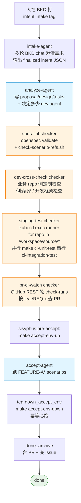
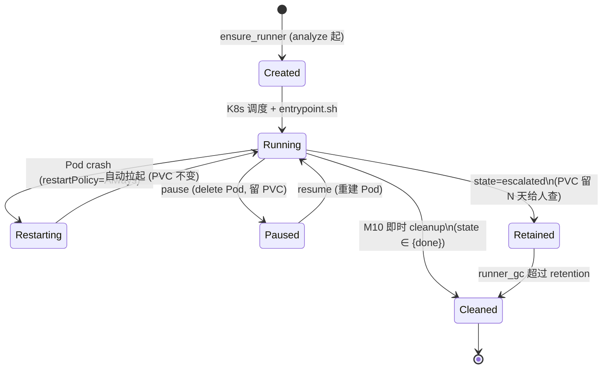

# Sisyphus 架构（v0.2 + M14 + M15）

> **AI-native CI 编排层**：薄薄一层调度 + 机械 checker + 度量，让 agent 干完整链路活。
>
> **不抢 AI 决定权**。内容质量、bug 该不该修、怎么改 —— 永远是 agent 的事。
> sisyphus 跑硬指标 / 路由 / 兜底 / 度量。

## 1. 哲学

| 原则 | 含义 | 体现在哪 |
|---|---|---|
| **薄编排，agent 决定** | 路由 / 状态机 / checker 是 sisyphus；判 PR 内容好不好、bug 该不该修是 agent | router.py 只翻译 webhook 不判内容；verifier-agent 主观决策 |
| **机械层 ≠ agent 层** | 跑测试 / 轮 GHA 不绕 agent，sisyphus 自己干 | M1 staging-test / M2 pr-ci-watch 都是 sisyphus checker |
| **失败先验，再试错** | stage fail 不直接 bugfix，先让 verifier-agent 看一眼是 fix / retry / escalate | M14b/c verifier 框架 |
| **指标驱动改进** | 每条决策入表，看板回答"哪条 prompt 该改" | stage_runs / verifier_decisions / 13 张 Metabase 卡 |
| **生产用最强模型** | 无"失败升级模型"自适应；haiku 只用于测试加速 | config.py 单模型字段 |
| **不要新 IDL** | M15 砍 manifest.yaml：业务 repo 描述走已有原语（Makefile target + git branch + BKD tag），sisyphus 不维护集中式 schema | docs/integration-contracts.md |

### 跟相邻系统的层级

```
┌────────────────────────────────────────────────────────┐
│  研发组织层： sisyphus (本仓库)                        │
│    - 串 analyze → spec-lint → dev-cross-check          │
│      → staging-test → pr-ci → accept → archive         │
│    - verifier-agent 主观决策替代固定 fail 分流          │
│    - watchdog / GC / 指标采集                           │
├────────────────────────────────────────────────────────┤
│  脚本 CI 层： GitHub Actions（互补不替代）              │
│    - lint / unit / integration / sonar / image-publish  │
│    - sisyphus pr-ci-watch checker 直接轮它的 check-runs │
├────────────────────────────────────────────────────────┤
│  agent 工具层： pure Claude Code skill / agent prompt   │
│    - IDE 内 turbo dev tool                              │
│    - 跟 sisyphus 不同层；sisyphus 在外面组织调度        │
└────────────────────────────────────────────────────────┘
```

## 2. 主流水线

happy path（含 INTAKING）十段，入口可选 `intent:intake`（推荐）或 `intent:analyze`（跳过澄清）一路自动到 `done`。

**入口选择**：
- `intent:intake` → INTAKING（不熟悉的仓先澄清，brainstorm 和实现物理隔离）
- `intent:analyze` → ANALYZING（跳过 intake，直接进 analyze，适合 trivial REQ）



## 3. 失败与迭代场景（verifier 子链）

任何 stage（含 staging-test、pr-ci、accept）失败 **不直接 bugfix**，先入 `REVIEW_RUNNING` 让 verifier-agent 主观判：

```mermaid
flowchart TD
    Stage[任意 stage_RUNNING]
    StageFail{stage 结果}
    Verifier[REVIEW_RUNNING<br/>verifier-agent 跑<br/>verifier/{stage}_{trigger}.md.j2]
    Decision{decision JSON<br/>action ?}
    NextStage[下一 stage]
    Fixer[FIXER_RUNNING<br/>start_fixer 起<br/>dev / spec fixer]
    Reverify[invoke_verifier_after_fix<br/>回 REVIEW_RUNNING]
    Escalated([ESCALATED<br/>含 flaky / 基础设施抖动])

    Stage --> StageFail
    StageFail -->|pass| Verifier
    StageFail -->|fail| Verifier
    Verifier --> Decision
    Decision -->|pass| NextStage
    Decision -->|fix + fixer={dev,spec}| Fixer --> Reverify --> Verifier
    Decision -->|escalate / schema invalid / flaky| Escalated

    classDef verifier fill:#f3e5f5,stroke:#7b1fa2
    classDef terminal fill:#ffebee,stroke:#c62828
    class Verifier,Reverify,Decision verifier
    class Escalated terminal
```

**为什么 success 也走 verifier**：M14b 让 verifier-agent 也对"机械 pass"做最后一道主观判（避免假阳性 / 偷工减料）。`trigger=success` 跟 `trigger=fail` 复用同一框架，prompt 模板分别在 `prompts/verifier/{stage}_success.md.j2` 和 `_fail.md.j2`。

**verifier decision 协议**（router.py `validate_decision`，3 路：retry_checker 已砍）：

```json
{
  "action": "pass | fix | escalate",
  "fixer": "dev | spec | null",
  "confidence": "high | low",
  "reason": "...",
  "target_repo": "phona/repo-a"
}
```

注：
- `action=fix` 时 `fixer` 必须非 null；其他 action `fixer` 必须 null。
- 基础设施 flaky / 外部服务抖动（SonarQube 503、GHA 抢占、网络 blip）→ `escalate`，
  sisyphus 不机制性兜 retry，由人介入重新触发。
- `target_repo`（**M16 多仓**）可选，多仓 REQ 时建议填，告诉 fixer 哪仓修。
  老的不带 `target_repo` 的五字段 decision 仍合法。

decision 写在 BKD verifier issue 的：
1. `decision:<urlsafe-base64-json>` tag（首选，机器写最稳）
2. issue description 里的 ```` ```json ```` 块（兜底）

schema 不合规 → `VERIFY_ESCALATE` → 终态 ESCALATED。

## 4. 三类决定者职责

| | 决定什么 | 谁做 | 怎么做 |
|---|---|---|---|
| **机械事实** | 测试是否退 0、CI 是否绿、env 是否起来 | sisyphus checker | exec / REST |
| **主观判断** | 这次 fail 是 spec 错 / 代码错 / flaky / 该 escalate | verifier-agent | LLM + decision JSON |
| **写代码** | 实现 / 修 bug / 改 spec | stage agent + fixer agent | Claude Agent in BKD issue |

```mermaid
flowchart LR
    subgraph sisyphus["sisyphus 编排层 (Python)"]
        Router[router.py<br/>tag → Event]
        SM[state.py<br/>状态机]
        Engine[engine.py<br/>action 调度<br/>+ stage_runs 落点]
        Watchdog[watchdog.py<br/>卡死兜底]
        GC[runner_gc.py<br/>资源回收]
    end

    subgraph mechanical["机械层 checker (Python in sisyphus)"]
        Staging[staging_test<br/>kubectl exec 跑 ci-unit-test && ci-integration-test]
        PRCI[pr_ci_watch<br/>GitHub REST]
    end

    subgraph subjective["主观层 (BKD agent)"]
        VerifierA[verifier-agent<br/>12 个 prompt 模板<br/>输出 decision JSON]
    end

    subgraph stages["stage / fixer agent (BKD agent)"]
        Analyze[analyze]
        Spec[spec (1~N 并行)]
        Dev[dev (1~N 并行)]
        Accept[accept]
        Fixer[fixer:dev<br/>fixer:spec]
        Archive[done-archive]
    end

    subgraph metrics["指标层 (Postgres + Metabase)"]
        EventLog[event_log]
        StageRuns[stage_runs<br/>M14e]
        VDecision[verifier_decisions<br/>M14e]
        Dashboards[13 张 Metabase 看板]
    end

    sisyphus --> mechanical
    sisyphus --> subjective
    sisyphus --> stages
    sisyphus --> metrics
    mechanical -.写结果.-> sisyphus
    subjective -.decision JSON.-> sisyphus
    stages -.session.completed.-> sisyphus
    metrics --> Dashboards
```

## 5. 角色分工详表

| 角色 | 职责 | 实现 | LOCKED 边界 |
|---|---|---|---|
| **sisyphus orchestrator** | 状态机 + 路由 + watchdog + GC + 指标采集 | Python, K8s Deployment | 不写业务代码、不审 PR 内容 |
| **机械 checker** | 跑测试 / 轮 CI / 跑 accept-env-up/down | Python, runner pod 内 exec | 只看 exit code / API 返回 |
| **analyze-agent** | 写 `proposal.md` / `design.md` / `tasks.md`（**每个被改的 source repo 的 `openspec/changes/REQ-x/` 下各一份**，没有主从）+ 调 `sisyphus-clone-repos.sh` 把所有仓 clone 到 `/workspace/source/<basename>/` + **默认激进拆** spec / dev 子 issue 压 wall-clock | BKD agent + analyze.md.j2 | 不写业务代码 |
| **spec-agent (1~N)** | 写 `contract-tests` + `acceptance-tests` 两块 spec 文档（默认 1 个 agent 一次写完；需要时 analyze-agent 可开多个并行） | BKD agent + spec.md.j2 | 不写业务代码、不改测试产物之外文件 |
| **dev-agent (1~N)** | 实现业务代码 + push `feat/REQ-x` + **真开 PR** | BKD agent + dev.md.j2 | 测试 LOCKED 不可改 |
| **verifier-agent** | 主观判 stage 是否真过（pass / fix / retry / escalate） | BKD agent + verifier/{stage}_{trigger}.md.j2 | 不写代码，只输出 decision JSON |
| **fixer-agent** | 改一类东西：dev fixer 改业务码、spec fixer 改 spec | BKD agent + bugfix.md.j2（过渡） | scope 由 verifier 指定 |
| **accept-agent** | 跑 FEATURE-A* scenarios，写 result:pass/fail tag | BKD agent + accept.md.j2 | 不改业务代码 |
| **done-archive agent** | 合 PR + 关 issue | BKD agent + done_archive.md.j2 | — |

## 6. Stage 与产物

| # | Stage | 触发 | 产物 / 副作用 | 推进信号 |
|---|---|---|---|---|
| 0 | **intake** (可选) | `intent:intake` tag | BKD chat 多轮澄清 + finalized intent JSON（6 字段）。不写代码，不开 PR | intake-agent PATCH `result:pass` + JSON 解析成功 → 新建 analyze issue |
| 1 | **analyze** | `intent:analyze` tag（跳过 intake）或 intake.pass 后新建 issue | `openspec/changes/REQ-x/{proposal,design,tasks}.md` 在**每个被改的 source repo** 各一份（没有主从）；高层文档放 spec home repo | session.completed + analyze tag |
| 2 | **spec-lint** (机械, for-each-repo) | analyze done | **遍历 `/workspace/source/*`**：每仓有 `openspec/changes/REQ-x/` 就跑 `openspec validate` + `check-scenario-refs.sh --specs-search-path`（跨仓引用）。任一仓红 → 整体红 | sisyphus 自己判，无 BKD agent |
| 3 | **dev-cross-check** (机械, for-each-repo) | spec-lint pass | 遍历每仓 `BASE_REV=$(git merge-base HEAD origin/main) make ci-lint`（ttpos-ci 标准，仅 lint 变更文件）；任一仓红 → 整体红 | sisyphus 自己判，无 BKD agent |
| 4 | **dev (1~N 并行)** | dev-cross-check pass | 业务代码 + 各仓 push `feat/REQ-x` + 开 PR（多仓 REQ 通常每仓一个 dev agent） | 每个 dev session.completed → mark_dev_reviewed_and_check 聚合 → DEV_ALL_PASSED |
| 5 | **staging-test** (机械, for-each-repo **并行**) | DEV_ALL_PASSED | 遍历每仓 `make ci-unit-test && make ci-integration-test`（**单 repo 内串行**，避免内存峰值叠加），**repo 之间并行**起所有仓；任一仓退非 0 → 整体红 | sisyphus 自己判，无 BKD agent |
| 6 | **pr-ci-watch** (机械) | staging-test pass | GitHub REST 轮 PR check-runs（按 `feat/REQ-x` branch 查 PR）直至全绿 / 任一红 / 1800s 超时 | sisyphus 自己判 |
| 7a | **accept env-up** (机械) | pr-ci pass | runner pod 跑 `make accept-env-up`，stdout 尾行 JSON 取 `endpoint` | env-up 失败 → ESCALATED |
| 7b | **accept** | env-up 完 | 跑 FEATURE-A* scenarios → result:pass / fail tag | session.completed + accept tag |
| 8 | **teardown** (机械, 必跑) | accept 完（pass 或 fail） | `make accept-env-down`，best-effort 失败只 warning | TEARDOWN_DONE_PASS / FAIL |
| 9 | **archive** | teardown_done_pass | 合 PR + 关 issue | ARCHIVE_DONE → DONE |

完整状态转移见 [state-machine.md](./state-machine.md)。

## 7. Stage 间数据流：靠 git branch + BKD tag + Makefile，不靠 IDL

M15 起 sisyphus 不再维护 `manifest.yaml` 这种集中式 IDL。stage 间靠下面几个原语传递信息：

| 原语 | 谁写 | 谁读 | 内容 |
|---|---|---|---|
| **BKD intent issue description** | 人 / analyze-agent | analyze / spec / dev / archive | 涉及哪些 source / integration repo（**平等列表**，无主从）、可选 "spec home repo"（弱归属，仅 archive 用） |
| **路径约定 `/workspace/source/<basename>/`** | sisyphus + `sisyphus-clone-repos.sh` | 所有 checker / agent | source repo clone 必须落到这个路径，checker 按它遍历 |
| **`openspec/changes/REQ-x/tasks.md`** | analyze | sisyphus fanout_dev、dev | 每仓自带一份；拆几个并行 dev 任务、每个任务 scope（含 target repo） |
| **git branch `feat/REQ-x`** | dev | pr-ci-watch、accept、staging-test | **每仓独立分支**；pr-ci 按 branch 在每仓找 PR |
| **`make ci-unit-test` + `ci-integration-test` target** | 业务 repo（一次性接入时定，对齐 ttpos-ci 标准） | staging-test checker | 每仓自己实现；checker for-each-repo `&&` 串行调 |
| **`make ci-lint` target**（M15+，对齐 ttpos-ci 标准） | 业务 repo | dev-cross-check checker | 每仓 go vet + golangci-lint，仅 lint 变更文件（BASE_REV env） |
| **`make accept-env-up` / `accept-env-down`** | integration repo | sisyphus accept stage | 起 / 拆 lab |
| **BKD issue tags** | 各 agent | router.py | stage 完成信号、result:pass/fail、verifier decision（含可选 `target_repo`） |

详见 [integration-contracts.md](./integration-contracts.md)。

## 7b. Objective Checker 框架（M15 + 多仓）

**所有机械 checker 都 for-each-repo 遍历 `/workspace/source/*`**——
sisyphus 不维护"哪个仓是主"，每个 source repo 平等地被遍历。
失败时 stderr 用 `=== FAIL: <repo-basename> ===` 标记**哪个仓**挂了，
verifier-agent 看 stderr 把 `target_repo` 填进 decision JSON。

**spec-lint**（analyze 完 → dev-cross-check 前）

目的：规范 spec 的完整性和跨仓引用一致性。

```bash
for repo in /workspace/source/*; do
  [ -d "$repo/openspec/changes/{REQ}" ] || continue
  (cd "$repo" && openspec validate openspec/changes/{REQ}) || fail=1
  # 跨仓 scenario 引用：用 --specs-search-path 让 lint 看得到其他仓的 specs
  others=$(ls -d /workspace/source/*/openspec/specs 2>/dev/null | grep -v "^$repo/" | tr '\n' ',')
  check-scenario-refs.sh "$repo" --specs-search-path "$others" || fail=1
done
```

- 任一仓失败 → 整体 fail → verifier-agent 决策
- 实现：`checkers/spec_lint.py`（**签名 `run_spec_lint(req_id, *, timeout_sec)`**，
  不再接 `leader_repo_path`——内部自己枚举）

**dev-cross-check**（spec-lint 完 → staging-test 前）

目的：业务 repo lint（go vet + golangci-lint），仅扫变更文件。对齐 ttpos-ci 标准 `ci-lint` target。

```bash
for repo in /workspace/source/*; do
  [ -f "$repo/Makefile" ] && grep -q '^ci-lint:' "$repo/Makefile" || continue
  base_rev=$(cd "$repo" && (git merge-base HEAD origin/main 2>/dev/null \
                       || git merge-base HEAD origin/develop 2>/dev/null \
                       || git merge-base HEAD origin/dev 2>/dev/null \
                       || echo ""))
  (cd "$repo" && BASE_REV="$base_rev" make ci-lint) || fail=1
done
```

- 任一仓非 0 → 整体 fail → verifier-agent 决策
- BASE_REV 为空时 ci-lint 退化为全量扫描（接入约定：业务 Makefile 用 `${BASE_REV:+--new-from-rev=$BASE_REV}`）

**staging-test**（dev 完 → pr-ci 前）

对齐 ttpos-ci 标准 `ci-unit-test` + `ci-integration-test` target。

```bash
# repo 之间并行（per-repo 30 min × N 串行会超 timeout）
# 单 repo 内 unit → integration 串行（避免内存峰值叠加撑爆 pod 8 GiB cgroup）
parallel for repo in /workspace/source/*; do
  (cd "$repo" && make ci-unit-test && make ci-integration-test) || fail=1
done
wait
```

- 任一仓非 0 → 整体 fail → verifier-agent 决策
- 单 repo 内串行只多 ~2-5min，但单 pod 内存峰值减半，节点能并发跑更多 req

## 8. Runner（K8s Pod + PVC，per-REQ）

> **⚠️ 设计契约：runner = 只读 checker**
>
> Runner pod 内只允许：`git clone`（拉源码）、跑 `make ci-*` / `make accept-env-*`、
> `kubectl exec` / `docker run`、读 GH check-runs。
>
> **任何 GH write 操作**（`git push`、`gh pr create`、`gh pr merge`、PR review
> comment、status check write）**一律打回 BKD Coder workspace（"开发机"）执行**，
> 由 Coder 自己注入的 gh auth 处理，跟 runner 的 `GH_TOKEN` secret 完全无关。
>
> 推论：
> - runner secret `gh_token` 应是 **fine-grained PAT, Contents: Read-only**
>   （或 Deploy Key），配错成 classic `repo` 不会让 sisyphus 主动写——但违背契约。
> - 任何 prompt / action 想在 runner 里跑 push/PR 操作，必须先改设计回来这条注释。
> - 全链需要 GH write 的部分（dev push feat/REQ-* + 开 PR、archive merge PR）由
>   BKD agent 在 Coder workspace 完成，是 BKD 的事，不是 sisyphus 的事。
>
> **PAT 配置 + 验证 playbook**：见 [integration-contracts.md §1c](./integration-contracts.md#1c-runner-github-pat只读)。
> patch K8s secret 前必跑 4 步 API 探测（curl /user / /user/orgs / /repos/x / git ls-remote），
> 否则 GitHub "Write access not granted" 错误文案常误导根因判断。

每个 REQ 在 `sisyphus-runners` namespace 起一个：
- **Pod** `runner-<REQ>` —— privileged + DinD + fuse-overlayfs
- **PVC** `workspace-<REQ>` —— 挂 `/workspace`，存 clone 的 repos + 中间产物

生命周期由 `k8s_runner.py` 管：



镜像两种：
- `runner/Dockerfile` —— Flutter 全家桶（~5GB），跑 ttpos-flutter
- `runner/go.Dockerfile` —— 精简 Go 镜像（~1GB）

镜像内 `/opt/sisyphus/scripts/` 挂着合约脚本（M15 objective checkers 用）：
- `check-scenario-refs.sh` —— spec-lint checker 用，验证 spec 中引用的场景名必须在 specs 中定义；`--specs-search-path` flag 支持跨仓引用
- `check-tasks-section-ownership.sh` —— 用于 dev-cross-check 或业务定制检查
- `pre-commit-acl.sh` —— 用于 dev-cross-check 或业务定制检查
- `sisyphus-clone-repos.sh` —— analyze agent 调用统一 clone 多仓 source repo 到 `/workspace/source/<basename>/`

orchestrator 注入 env：

| env | 何时注入 | 用途 |
|---|---|---|
| `SISYPHUS_REQ_ID` | 所有 stage | 业务 Makefile 拼 namespace / 标签 |
| `SISYPHUS_NAMESPACE=accept-<req-id>` | accept 阶段 | `helm install -n $SISYPHUS_NAMESPACE` |
| `SISYPHUS_STAGE` | accept-env-up / accept-env-down | 给业务 Makefile 区分阶段 |
| `SISYPHUS_RUNNER=1` | 镜像内置 | 让脚本判断"在 sisyphus runner 里" |

详见 [integration-contracts.md](./integration-contracts.md)。

## 9. BKD 客户端（REST 默认）

PR #1 起 sisyphus 调 BKD 走 REST（BKD ≥ 0.0.65 已废 `/api/mcp`）：

- **transport**: `bkd_transport=rest`（默认）/ `mcp`（兜底）
- **入口**: `BKDClient(base_url, token)` factory（`orchestrator/src/orchestrator/bkd.py`）
- **方法**: `create_issue` / `follow_up_issue` / `update_issue` / `get_issue` / `list_issues`
- **PR #18 起 `create_issue` 默认 `useWorktree=True`** —— 强制 agent 隔离 working tree，并行多 agent 不互抢

webhook 反向：BKD `session.completed` / `session.failed` / `issue.updated` → orchestrator `webhook.py` → router 翻译 → engine.step 推状态机。

## 10. 观测系统

```
┌─────────────────────────┐
│ orchestrator 写表       │
│  - event_log (kind)     │   ← 任何决策、check 结果都写
│  - stage_runs (M14e)    │   ← stage 起止 / agent / token / model（M15 接入 caller）
│  - verifier_decisions   │   ← 每条 verifier JSON + 后续 actual_outcome
│  - bkd_snapshot         │   ← BKD issue 状态镜像（5 min sync）
└─────────────────────────┘
            │
            ▼ Postgres (sisyphus 库)
            │
┌─────────────────────────┐
│ Metabase                │
│  Q1-Q5  (M7)  artifact_checks 钻牛角尖、慢异常、通过率、失败分桶 │
│  Q6-Q13 (M14e) duration P95 / verifier 准确率 / fixer 命中率   │
│           / token 成本 / 并行加速比 / bugfix loop 异常        │
│           / watchdog escalate 频率                            │
└─────────────────────────┘
```

详细：[observability.md](./observability.md) + [observability/sisyphus-dashboard.md](../observability/sisyphus-dashboard.md)。

**核心准则**：观测不是"看好看的图"，是**让每次改 prompt / 阈值能用数据验证效果**。`config_version` + `improvement_log` 两张表锁住"改动 → 度量"循环。

## 11. 兜底机制

| 机制 | 触发 | 行为 | 文件 |
|---|---|---|---|
| **verifier-agent** | 任意 stage 完成 | LLM 主观判 pass/fix/retry/escalate；无效 JSON → escalate | actions/_verifier.py |
| **watchdog** (M8) | 后台轮询 | REQ 卡 in-flight 超 N 秒 + BKD session 不在跑 → SESSION_FAILED → ESCALATED | watchdog.py |
| **runner GC** (M10) | 后台轮询 | done 立删；escalated 留 N 天再删；孤儿 runner 也删 | runner_gc.py |
| **CAS state transition** | 每条 transition | Postgres 行级 CAS 防并发抢同 REQ | store/req_state.py |
| **idempotent action** | webhook 重试 | 大部分 action 标 `idempotent=True`；create_* 例外 | actions/__init__.py |

## 12. 已知约束 / 不支持

- **跨 repo 协调**（M16 起支持多仓平等）：每个 source repo 自带 `openspec/changes/REQ-x/`，
  跨仓 contract 写在 producer 仓，scenario ID 用 `[<REPO>-S<N>]` 防撞。
  "spec home repo"（弱归属）只在 done_archive 高层文档归档时用，不是 ctx 字段。
  详见 [integration-contracts.md §多仓 REQ 协调约定](./integration-contracts.md)。
- **回归归档**：accept 通过的 spec 不会自动并入更大 regression suite，需要新 REQ 显式补。
- **Hotfix 入口**：紧急修复目前还是走完整流水线 + skip flag，没有专门的 hotfix mode。
- **Token 成本告警**：Q10 已出图但未自动告警。
- **真正的 root-cause fixer prompt**：当前 fixer 复用 `bugfix.md.j2` 过渡，后续 PR 才会做 dev/spec 两类专用 prompt。

## 13. 演进路线（in-flight）

- **真正的 dev 并行 fanout** —— M14d 框架已有，M15 退化成单 dev；下一步按 tasks.md 真拆多 dev agent
- **专用 fixer prompts** —— `verifier-fix-dev.md.j2` / `verifier-fix-spec.md.j2`
- **接 ttpos-arch-lab 真 e2e** —— accept-env-up / accept-env-down 落到生产 lab
- **Token 自动告警** —— Q10 + 阈值 → notification
