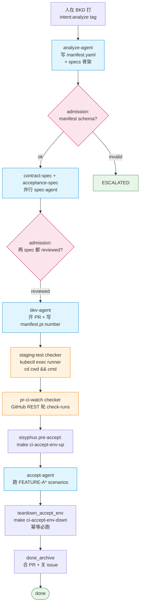
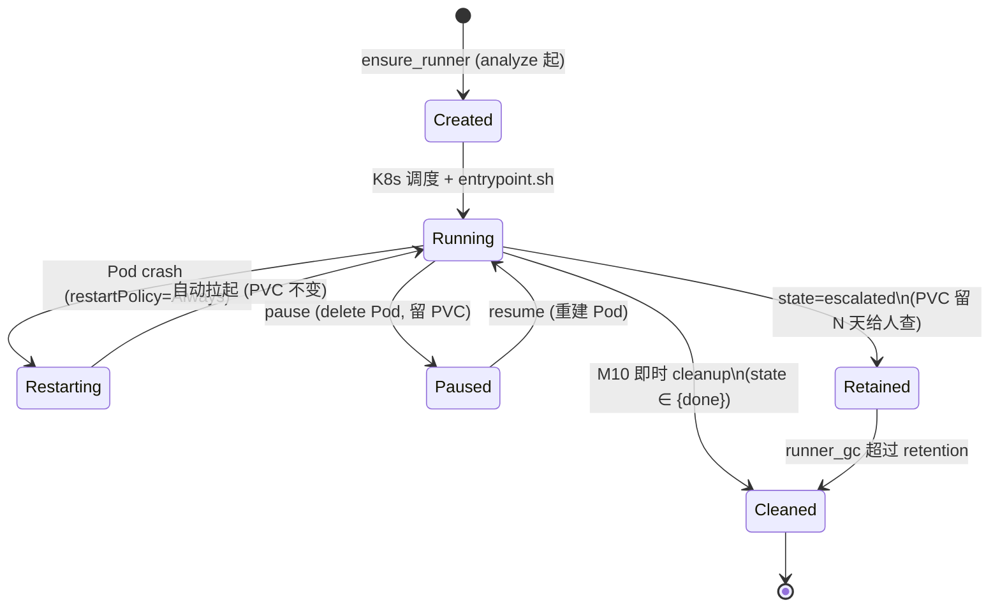

# Sisyphus 架构（v0.2 + M14）

> **AI-native CI 编排层**：薄薄一层调度 + 机械 checker + 度量，让 agent 干完整链路活。
>
> **不抢 AI 决定权**。内容质量、bug 该不该修、怎么改 —— 永远是 agent 的事。
> sisyphus 跑硬指标 / 路由 / 兜底 / 度量。

## 1. 哲学

| 原则 | 含义 | 体现在哪 |
|---|---|---|
| **薄编排，agent 决定** | 路由 / 状态机 / checker 是 sisyphus；判 PR 内容好不好、bug 该不该修是 agent | router.py 只翻译 webhook 不判内容；verifier-agent 主观决策 |
| **机械层 ≠ agent 层** | 跑测试 / 轮 GHA / 校验 schema 不绕 agent，sisyphus 自己干 | M1 staging-test / M2 pr-ci-watch / M3 manifest_validate 都是 sisyphus checker |
| **失败先验，再试错** | stage fail 不直接 bugfix，先让 verifier-agent 看一眼是 fix / retry / spec / escalate | M14b/c verifier 框架 |
| **指标驱动改进** | 每条决策入表，看板回答"哪条 prompt 该改" | stage_runs / verifier_decisions / 13 张 Metabase 卡 |
| **生产用最强模型** | 无"失败升级模型"自适应；haiku 只用于测试加速 | config.py 单模型字段 |

### 跟相邻系统的层级

```
┌────────────────────────────────────────────────────────┐
│  研发组织层： sisyphus (本仓库)                        │
│    - 串 analyze → spec → dev → staging-test → pr-ci    │
│      → accept → archive                                 │
│    - verifier-agent 主观决策替代固定 fail 分流          │
│    - watchdog / GC / 指标采集                           │
├────────────────────────────────────────────────────────┤
│  脚本 CI 层： GitHub Actions（互补不替代）              │
│    - lint / unit / integration / sonar / image-publish  │
│    - sisyphus pr-ci-watch checker 直接轮它的 check-runs │
├────────────────────────────────────────────────────────┤
│  agent 工具层： pure Claude Code skill / agent prompt   │
│    - IDE 内 turbo dev tool                              │
│    - 跟 sisyphus 不同层；sisyphus 在外面组织调度        │
└────────────────────────────────────────────────────────┘
```

## 2. 主流水线

happy path 七段，从 `intent:analyze` tag 一路自动到 `done`。



## 3. 失败与迭代场景（verifier 子链）

任何 stage（含 staging-test、pr-ci、accept）失败 **不直接 bugfix**，先入 `REVIEW_RUNNING` 让 verifier-agent 主观判：

```mermaid
flowchart TD
    Stage[任意 stage_RUNNING]
    StageFail{stage 结果}
    Verifier[REVIEW_RUNNING<br/>verifier-agent 跑<br/>verifier/{stage}_{trigger}.md.j2]
    Decision{decision JSON<br/>action ?}
    NextStage[下一 stage]
    Fixer[FIXER_RUNNING<br/>start_fixer 起<br/>dev / spec / manifest fixer]
    Reverify[invoke_verifier_after_fix<br/>回 REVIEW_RUNNING]
    Retry[apply_verify_retry_checker<br/>回 stage_RUNNING<br/>重跑机械 checker]
    Escalated([ESCALATED])

    Stage --> StageFail
    StageFail -->|pass| Verifier
    StageFail -->|fail| Verifier
    Verifier --> Decision
    Decision -->|pass| NextStage
    Decision -->|fix + fixer={dev,spec,manifest}| Fixer --> Reverify --> Verifier
    Decision -->|retry_checker| Retry --> Stage
    Decision -->|escalate / schema invalid| Escalated

    classDef verifier fill:#f3e5f5,stroke:#7b1fa2
    classDef terminal fill:#ffebee,stroke:#c62828
    class Verifier,Reverify,Decision verifier
    class Escalated terminal
```

**为什么 success 也走 verifier**：M14b 让 verifier-agent 也对"机械 pass"做最后一道主观判（避免假阳性 / 偷工减料）。`trigger=success` 跟 `trigger=fail` 复用同一框架，prompt 模板分别在 `prompts/verifier/{stage}_success.md.j2` 和 `_fail.md.j2`。

**verifier decision 协议**（router.py:33 `validate_decision`）：

```json
{
  "action": "pass | fix | retry_checker | escalate",
  "fixer": "dev | spec | manifest | null",
  "confidence": "high | low",
  "reason": "..."
}
```

注：`action=fix` 时 `fixer` 必须非 null；其他 action `fixer` 必须 null。

decision 写在 BKD verifier issue 的：
1. `decision:<urlsafe-base64-json>` tag（首选，机器写最稳）
2. issue description 里的 ```` ```json ```` 块（兜底）

schema 不合规 → `VERIFY_ESCALATE` → 终态 ESCALATED。

## 4. 三类决定者职责

| | 决定什么 | 谁做 | 怎么做 |
|---|---|---|---|
| **机械事实** | 测试是否退 0、CI 是否绿、manifest 是否合 schema、env 是否起来 | sisyphus checker | exec / REST / jsonschema |
| **主观判断** | 这次 fail 是 spec 错 / 代码错 / flaky / 该 escalate | verifier-agent | LLM + decision JSON |
| **写代码** | 实现 / 修 bug / 改 spec / 改 manifest | stage agent + fixer agent | Claude Agent in BKD issue |

```mermaid
flowchart LR
    subgraph sisyphus["sisyphus 编排层 (Python)"]
        Router[router.py<br/>tag → Event]
        SM[state.py<br/>状态机]
        Engine[engine.py<br/>action 调度]
        Watchdog[watchdog.py<br/>卡死兜底]
        GC[runner_gc.py<br/>资源回收]
    end

    subgraph mechanical["机械层 checker (Python in sisyphus)"]
        Manifest[manifest_validate<br/>jsonschema + 跨字段]
        Staging[staging_test<br/>kubectl exec 跑 make]
        PRCI[pr_ci_watch<br/>GitHub REST]
    end

    subgraph subjective["主观层 (BKD agent)"]
        VerifierA[verifier-agent<br/>12 个 prompt 模板<br/>输出 decision JSON]
    end

    subgraph stages["stage / fixer agent (BKD agent)"]
        Analyze[analyze]
        Spec[contract-spec<br/>acceptance-spec]
        Dev[dev]
        Accept[accept]
        Fixer[fixer:dev<br/>fixer:spec<br/>fixer:manifest]
        Archive[done-archive]
    end

    subgraph metrics["指标层 (Postgres + Metabase)"]
        EventLog[event_log]
        StageRuns[stage_runs<br/>M14e]
        VDecision[verifier_decisions<br/>M14e]
        Dashboards[13 张 Metabase 看板]
    end

    sisyphus --> mechanical
    sisyphus --> subjective
    sisyphus --> stages
    sisyphus --> metrics
    mechanical -.写结果.-> sisyphus
    subjective -.decision JSON.-> sisyphus
    stages -.session.completed.-> sisyphus
    metrics --> Dashboards
```

## 5. 角色分工详表

| 角色 | 职责 | 实现 | LOCKED 边界 |
|---|---|---|---|
| **sisyphus orchestrator** | 状态机 + 路由 + watchdog + GC + 指标采集 | Python, K8s Deployment | 不写业务代码、不审 PR 内容 |
| **机械 checker** | manifest schema / 跑测试 / 轮 CI / 跑 env-up/down | Python, runner pod 内 exec | 只看 exit code / API 返回 |
| **analyze-agent** | 写 `manifest.yaml`（schema_version / req_id / sources / test / pr）+ 写 specs/ 骨架 | BKD agent + analyze.md.j2 | 不写业务代码 |
| **spec-agent (×2)** | 写 contract-spec / acceptance-spec | BKD agent + spec.md.j2 | 一个 LOCKED 之后另一个仍可改 |
| **dev-agent** | 实现业务代码 + **真开 PR** + 把 PR number 回写 manifest | BKD agent + dev.md.j2 | 测试 LOCKED 不可改 |
| **verifier-agent** | 主观判 stage 是否真过（pass / fix / retry / escalate） | BKD agent + verifier/{stage}_{trigger}.md.j2 | 不写代码，只输出 decision JSON |
| **fixer-agent** | 改一类东西：dev fixer 改业务码、spec fixer 改 spec、manifest fixer 改 manifest | BKD agent + bugfix.md.j2（过渡） | scope 由 verifier 指定 |
| **accept-agent** | 跑 FEATURE-A* scenarios，写 result:pass/fail tag | BKD agent + accept.md.j2 | 不改业务代码 |
| **done-archive agent** | 合 PR + 关 issue | BKD agent + done_archive.md.j2 | — |

## 6. Stage 与产物

| # | Stage | 触发 | 产物 / 副作用 | 推进信号 |
|---|---|---|---|---|
| 1 | **analyze** | `intent:analyze` tag | `/workspace/.sisyphus/manifest.yaml` + specs 骨架 | session.completed + analyze tag |
| — | admission(manifest) | analyze 完 | jsonschema + 跨字段（一个 leader、source 路径前缀、test/pr 必填） | 通过 → SPECS_RUNNING；不过 → ESCALATED |
| 2 | **specs (×2 并行)** | analyze pass | `tests/contract/*` + `tests/acceptance/*` LOCKED | 两个 spec 都 reviewed → SPEC_ALL_PASSED |
| 3 | **dev** | SPEC_ALL_PASSED | 业务代码 + 推 PR + `manifest.pr.number` 回写 | session.completed + dev tag |
| 4 | **staging-test** (机械) | dev push | `cd <manifest.test.cwd> && <manifest.test.cmd>` 退码 0 / 1 | sisyphus 自己判，无 BKD agent |
| 5 | **pr-ci-watch** (机械) | staging-test pass | GitHub REST 轮 check-runs 直至 conclusion 全绿 / 任一红 / 1800s 超时 | sisyphus 自己判 |
| 6a | **accept env-up** (机械) | pr-ci pass | runner pod 跑 `make ci-accept-env-up`，stdout 尾行 JSON 取 `endpoint` | env-up 失败 → ESCALATED |
| 6b | **accept** | env-up 完 | 跑 FEATURE-A* scenarios → result:pass / fail tag | session.completed + accept tag |
| 7 | **teardown** (机械, 必跑) | accept 完（pass 或 fail） | `make ci-accept-env-down`，best-effort 失败只 warning | TEARDOWN_DONE_PASS / FAIL |
| 8 | **archive** | teardown_done_pass | 合 PR + 关 issue | ARCHIVE_DONE → DONE |

完整状态转移见 [state-machine.md](./state-machine.md)。

## 7. 数据流：manifest.yaml 是核心契约

`/workspace/.sisyphus/manifest.yaml` 由 analyze-agent 写，被 admission / staging-test / pr-ci-watch / accept env / teardown 反复读。schema 在 [orchestrator/src/orchestrator/schemas/manifest.json](../orchestrator/src/orchestrator/schemas/manifest.json)。

```yaml
schema_version: 1
req_id: REQ-29
sources:
  - repo: phona/ttpos-server-go
    path: source/ttpos-server-go
    role: leader              # 必有且仅有 1 个 leader
    branch: stage/REQ-29
integration:                  # 可选；仅 accept 用
  repo: phona/ttpos-arch-lab
  path: integration/ttpos-arch-lab
test:
  cmd: make ci-unit-test ci-integration-test
  cwd: source/ttpos-server-go
  timeout_sec: 600
pr:
  repo: phona/ttpos-server-go
  number: 123                 # dev-agent 开 PR 后回写
```

各字段消费者：

| 字段 | 谁读 | 用途 |
|---|---|---|
| `sources[].repo / path / branch` | runner 镜像内的 git clone 脚本 | 准备 working tree |
| `sources[].role=leader` | manifest_validate | 校验"恰好一个 leader" |
| `test.cmd / cwd / timeout_sec` | staging_test checker | 跑命令 |
| `pr.repo / number` | pr_ci_watch checker | 找 PR 头 SHA + check-runs |
| `integration.path` | create_accept / teardown | `cd /workspace/integration/* && make ci-*` |

## 8. Runner（K8s Pod + PVC，per-REQ）

每个 REQ 在 `sisyphus-runners` namespace 起一个：
- **Pod** `runner-<REQ>` —— privileged + DinD + fuse-overlayfs
- **PVC** `workspace-<REQ>` —— 挂 `/workspace`，存 clone 的 repos + manifest.yaml + 中间产物

生命周期由 `k8s_runner.py` 管：



镜像两种：
- `runner/Dockerfile` —— Flutter 全家桶（~5GB），跑 ttpos-flutter
- `runner/go.Dockerfile` —— 精简 Go 镜像（~1GB）

镜像内 `/opt/sisyphus/scripts/` 挂着合约脚本：
- `validate-manifest.py` —— admission 兜底
- `check-scenario-refs.sh` / `check-tasks-section-ownership.sh` / `pre-commit-acl.sh` —— spec/dev pre-commit 用

orchestrator 注入 env：

| env | 何时注入 | 用途 |
|---|---|---|
| `SISYPHUS_REQ_ID` | 所有 stage | 业务 Makefile 拼 namespace / 标签 |
| `SISYPHUS_NAMESPACE=accept-<req-id>` | accept 阶段 | `helm install -n $SISYPHUS_NAMESPACE` |
| `SISYPHUS_STAGE` | accept env-up / teardown | 给业务 Makefile 区分阶段 |
| `SISYPHUS_RUNNER=1` | 镜像内置 | 让脚本判断"在 sisyphus runner 里" |

详见 [integration-contracts.md](./integration-contracts.md)。

## 9. BKD 客户端（REST 默认）

PR #1 起 sisyphus 调 BKD 走 REST（BKD ≥ 0.0.65 已废 `/api/mcp`）：

- **transport**: `bkd_transport=rest`（默认）/ `mcp`（兜底）
- **入口**: `BKDClient(base_url, token)` factory（`orchestrator/src/orchestrator/bkd.py`）
- **方法**: `create_issue` / `follow_up_issue` / `update_issue` / `get_issue`
- **PR #18 起 `create_issue` 默认 `useWorktree=True`** —— 强制 agent 隔离 working tree，并行多 agent 不互抢

webhook 反向：BKD `session.completed` / `session.failed` / `issue.updated` → orchestrator `webhook.py` → router 翻译 → engine.step 推状态机。

## 10. 观测系统

```
┌─────────────────────────┐
│ orchestrator 写表       │
│  - event_log (kind)     │   ← 任何决策、check 结果都写
│  - stage_runs (M14e)    │   ← stage 起止 / agent / token / model
│  - verifier_decisions   │   ← 每条 verifier JSON + 后续 actual_outcome
│  - bkd_snapshot         │   ← BKD issue 状态镜像（5 min sync）
└─────────────────────────┘
            │
            ▼ Postgres (sisyphus 库)
            │
┌─────────────────────────┐
│ Metabase                │
│  Q1-Q5  (M7)  artifact_checks 钻牛角尖、慢异常、通过率、失败分桶 │
│  Q6-Q13 (M14e) duration P95 / verifier 准确率 / fixer 命中率   │
│           / token 成本 / 并行加速比 / bugfix loop 异常        │
│           / watchdog escalate 频率                            │
└─────────────────────────┘
```

详细：[observability.md](./observability.md) + [observability/sisyphus-dashboard.md](../observability/sisyphus-dashboard.md)。

**核心准则**：观测不是"看好看的图"，是**让每次改 prompt / 阈值能用数据验证效果**。`config_version` + `improvement_log` 两张表锁住"改动 → 度量"循环。

## 11. 兜底机制

| 机制 | 触发 | 行为 | 文件 |
|---|---|---|---|
| **admission gate** | analyze / spec 完 | manifest schema 不过 → ESCALATED；不卡 ambiguity（M12 已砍交回 agent 自管） | checkers/manifest_validate.py |
| **verifier-agent** | 任意 stage 完成 | LLM 主观判 pass/fix/retry/escalate；无效 JSON → escalate | actions/_verifier.py |
| **watchdog** (M8) | 后台轮询 | REQ 卡 in-flight 超 N 秒 + BKD session 不在跑 → SESSION_FAILED → ESCALATED | watchdog.py |
| **runner GC** (M10) | 后台轮询 | done 立删；escalated 留 N 天再删；孤儿 runner 也删 | runner_gc.py |
| **CAS state transition** | 每条 transition | Postgres 行级 CAS 防并发抢同 REQ | store/req_state.py |
| **idempotent action** | webhook 重试 | 大部分 action 标 `idempotent=True`；create_* 例外 | actions/__init__.py |

## 12. 已知约束 / 不支持

- **跨 repo 协调**：当前一个 REQ 主改一个 leader repo，integration 用 single integration 块。多 leader 暂不支持。
- **回归归档**：accept 通过的 spec 不会自动并入更大 regression suite，需要新 REQ 显式补。
- **Hotfix 入口**：紧急修复目前还是走完整流水线 + skip flag，没有专门的 hotfix mode。
- **Token 成本告警**：Q10 已出图但未自动告警。
- **真正的 root-cause fixer prompt**：当前 fixer 复用 `bugfix.md.j2` 过渡，PR4 / 后续 PR 才会做 dev/spec/manifest 三类专用 prompt。

## 13. 演进路线（in-flight）

- **M14d** —— dev 并行 fanout（按 source repo 切多 dev-agent，加速大改）
- **专用 fixer prompts** —— `verifier-fix-dev.md.j2` / `verifier-fix-spec.md.j2` / `verifier-fix-manifest.md.j2`
- **接 ttpos-arch-lab 真 e2e** —— accept env-up / env-down 落到生产 lab
- **Token 自动告警** —— Q10 + 阈值 → notification
