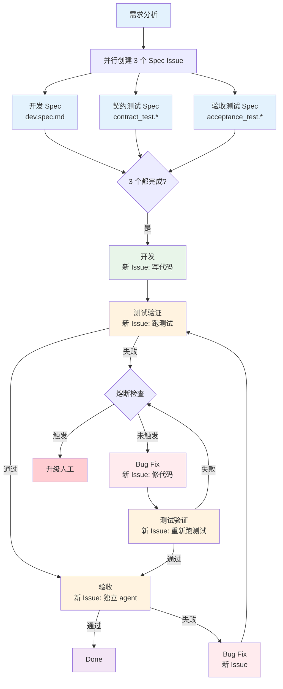
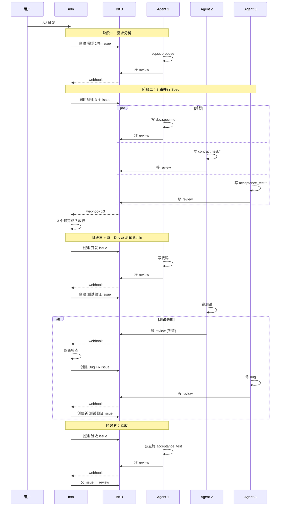

# Sisyphus 架构设计

> 契约驱动 + 测试先行 + 对抗验证的 AI 无人值守开发平台。

## 核心哲学

- **契约驱动（CDD）**：OpenAPI Spec 为唯一真相源
- **测试先行（TDD）**：先写测试再写实现，测试 LOCKED 不可改
- **对抗验证**：开发和测试是不同 agent，持续 battle，不允许自己出题自己答
- **Issue 即工作单元**：每次修 bug、每次重测都是新 issue、新 agent

```
有人阶段                    无人阶段
需求分析 → 三路并行Spec  →  Dev ⇄ 测试（battle 循环）→ 验收 → Done
有歧义就停   全部完成放行    熔断兜底
```

## 流程全景



## 每个阶段详解

### 阶段一：需求分析（有人，串行）

| 项 | 说明 |
|---|------|
| **Issue** | `[REQ-xx] 需求分析` tag: analyze |
| **输入** | 需求描述 |
| **做什么** | /opsx:propose 拆解，产出 openspec artifacts + contract.spec.yaml |
| **不做** | 不写代码，不写测试 |
| **歧义** | 停下来问用户 |

### 阶段二：Spec 编写（有人，三路并行）

需求分析完成后，n8n **同时创建 3 个 issue**：

| Issue | Tag | 输入 | 产出 | 做什么 |
|-------|-----|------|------|--------|
| `[REQ-xx] 开发Spec` | dev-spec | openspec artifacts | dev.spec.md | 写实现指南 |
| `[REQ-xx] 契约测试Spec` | contract-spec | contract.spec.yaml | contract_test.* | 写 API schema 测试 |
| `[REQ-xx] 验收测试Spec` | accept-spec | openspec specs/ | acceptance_test.* | 写 Given/When/Then 测试 |

- 3 个 agent 互相独立，互不知道对方写了什么
- 3 个都完成后 n8n 才放行进入开发阶段
- 测试代码产出后 **LOCKED**，后续不可修改

### 阶段三：开发（无人，串行）

| 项 | 说明 |
|---|------|
| **Issue** | `[REQ-xx] 开发` tag: dev |
| **输入** | dev.spec.md + 测试代码（只读） |
| **做什么** | 写业务代码 + 单元测试 |
| **不做** | 不修改 contract_test / acceptance_test |

### 阶段四：测试验证（无人，串行）

| 项 | 说明 |
|---|------|
| **Issue** | `[REQ-xx] 测试验证` tag: verify |
| **执行者** | 独立 agent，不参与开发 |
| **做什么** | 跑 L0-L3 分层测试，报告结果 |
| **不做** | 不改代码，不改测试 |
| **通过** | → 验收阶段 |
| **失败** | → 创建 Bug Fix Issue |

### Battle 循环：Dev ⇄ 测试

```
测试验证失败
  → n8n 熔断检查（轮次 ≥ 3？超时？token 超限？）
  → 未触发：创建 [REQ-xx] Bug Fix Issue（tag: bugfix, round-N）
    → 新 agent 读失败日志 + 代码 → 修 bug → commit
    → n8n 创建新的 [REQ-xx] 测试验证 Issue
    → 新 agent 跑测试
    → 通过？→ 验收
    → 失败？→ 再来一轮
  → 触发熔断：升级人工
```

**关键**：每一轮都是新 issue、新 agent。不是同一个 agent 自己改自己测。

### 阶段五：验收（无人，串行）

| 项 | 说明 |
|---|------|
| **Issue** | `[REQ-xx] 验收` tag: accept |
| **执行者** | 独立 agent，无开发上下文 |
| **做什么** | 部署环境，跑 acceptance_test.* |
| **不做** | 不改代码，不改测试 |
| **通过** | → Done |
| **失败** | → 创建 Bug Fix Issue → 回到 battle 循环 |

## Issue 关联

```
父 Issue: "实现 /api/xxx 接口"
  ├── [REQ-xx] 需求分析          tag: analyze, REQ-xx
  ├── [REQ-xx] 开发Spec          tag: dev-spec, REQ-xx
  ├── [REQ-xx] 契约测试Spec       tag: contract-spec, REQ-xx
  ├── [REQ-xx] 验收测试Spec       tag: accept-spec, REQ-xx
  ├── [REQ-xx] 开发              tag: dev, REQ-xx
  ├── [REQ-xx] 测试验证           tag: verify, REQ-xx
  ├── [REQ-xx] Bug Fix Round 1   tag: bugfix, REQ-xx, round-1
  ├── [REQ-xx] 测试验证 Round 2   tag: verify, REQ-xx, round-2
  └── [REQ-xx] 验收              tag: accept, REQ-xx
```

## 系统协作



## n8n 架构

**2 个 webhook**：

| Webhook | 触发 | 逻辑 |
|---------|------|------|
| `/v2` | 入口 | 创建需求分析 issue |
| `/bkd-events` | BKD session.completed/failed | 按 title/tag 路由，处理并行等待、battle 循环、熔断 |

`/bkd-events` 路由逻辑：

```
收到 webhook → 提取 title
  "需求分析" → 同时创建 3 个 Spec issue
  "开发Spec" / "契约测试Spec" / "验收测试Spec"
    → 检查另外 2 个是否也完成
    → 3 个都完成 → 创建 开发 issue
    → 否则 → 等待
  "开发" → 创建 测试验证 issue
  "测试验证"
    → 判断通过/失败（从 title 或 payload 获取）
    → 通过 → 创建 验收 issue
    → 失败 → 熔断检查 → 创建 Bug Fix issue
  "Bug Fix" → 创建 测试验证 issue
  "验收"
    → 通过 → 父 issue review → Done
    → 失败 → 创建 Bug Fix issue
```

## 熔断

```
n8n 通过 webhook payload 中的 round tag 跟踪轮次：
  round-1, round-2, round-3...

任一条件触发 → 升级人工：
  - 轮次 ≥ 3
  - 总耗时超限
  - 父 issue 创建时间距今超过 1 小时
```

## 分工

| 角色 | 做什么 | 不做什么 |
|------|--------|---------|
| **n8n** | 阶段串联、并行等待、battle 循环、熔断、可观测性 | 不做 AI 判断 |
| **BKD** | issue 管理、agent 启动、webhook 通知 | 不做阶段决策 |
| **每个 Agent** | 执行单个纯粹任务、移 review | 不做跨阶段编排、不修改 LOCKED 文件 |
| **OpenSpec** | 需求拆解 | — |
| **aissh** | 远程控制调试环境 | — |
