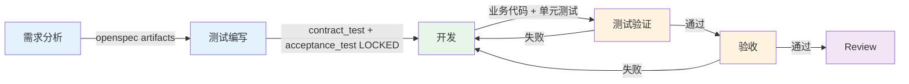
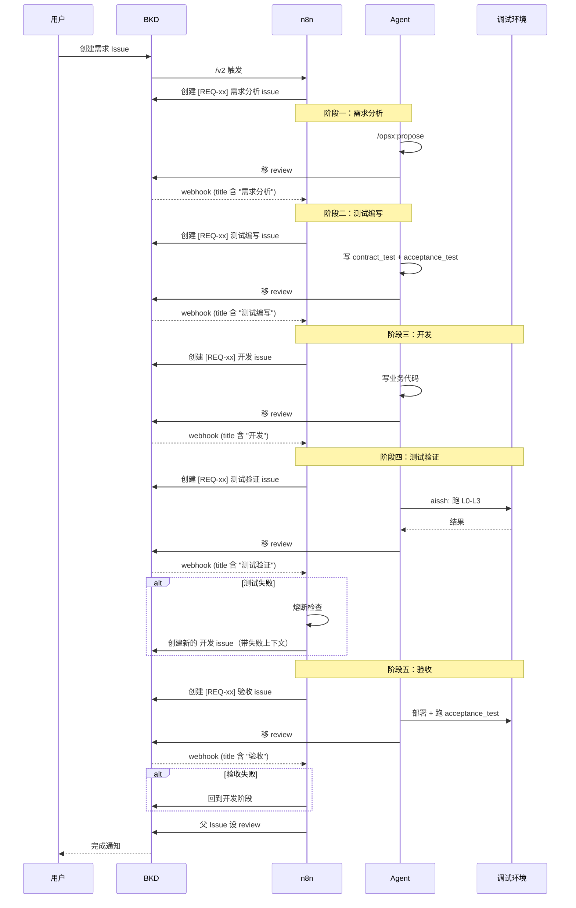
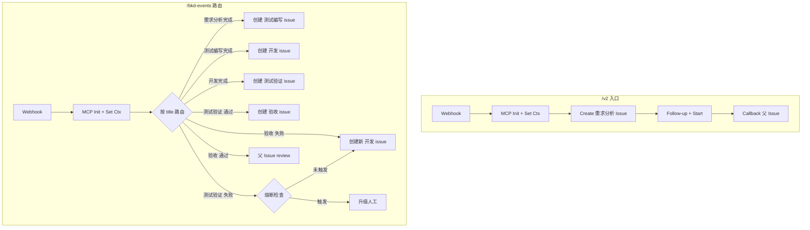

# Sisyphus 架构设计

> 契约驱动 + 测试先行的 AI 无人值守开发平台。

## 核心哲学

```
有人阶段（人机协作）           无人阶段（全自动）
需求分析 → 测试编写      →    开发 → 测试验证 → 验收
有歧义就停    测试锁定          熔断兜底
```

- **契约驱动（CDD）**：OpenAPI Spec 为唯一真相源
- **测试先行（TDD）**：先写测试再写实现，测试 LOCKED 不可改
- **每个阶段只做一件事**：产出物明确，职责不交叉

## 五阶段流程



### 阶段一：需求分析（有人）

| 项 | 说明 |
|---|------|
| **输入** | 需求描述 |
| **做什么** | /opsx:propose 拆解需求，设计合约边界 |
| **产出** | openspec/changes/xxx/ (proposal.md, specs/, design.md, tasks.md) |
| **不做** | 不写代码，不写测试 |
| **歧义** | 停下来问用户 |

### 阶段二：测试编写（有人）

| 项 | 说明 |
|---|------|
| **输入** | openspec artifacts + contract.spec.yaml |
| **做什么** | 写契约测试代码 + 验收测试代码 |
| **产出** | contract_test.* + acceptance_test.* |
| **不做** | 不写业务代码 |
| **LOCKED** | 测试产出后锁定，后续阶段不可修改 |
| **歧义** | 停下来问用户（最后的人工关卡） |

### 阶段三：开发（无人）

| 项 | 说明 |
|---|------|
| **输入** | openspec artifacts + 测试代码（只读） |
| **做什么** | 按 tasks.md 写业务代码 + 单元测试 |
| **产出** | 业务代码 + 单元测试 |
| **不做** | 不修改 contract_test / acceptance_test / contract.spec |
| **完成** | commit + push |

### 阶段四：测试验证（无人）

| 项 | 说明 |
|---|------|
| **输入** | 代码 + 所有测试 |
| **做什么** | 在调试环境跑分层测试 |
| **分层** | L0 lint → L1 单元测试 → L2 契约测试 → L3 集成测试 |
| **不做** | 不改代码，只报告结果 |
| **结果** | 通过 → 验收，失败 → 回开发 |

### 阶段五：验收（无人）

| 项 | 说明 |
|---|------|
| **输入** | acceptance_test.* + 干净环境 |
| **执行者** | 独立 agent，无开发上下文 |
| **做什么** | 部署完整环境，跑验收测试 |
| **不做** | 不改代码，不改测试 |
| **结果** | 通过 → review，失败 → 回开发 |

## 系统协作



## Issue 关联与可观测性

同一需求的所有 issue 通过 **tag** 和 **父 issue follow-up** 关联：

```
父 Issue: "实现 /api/connections 接口"
  ├── [REQ-xx] 需求分析    (tags: REQ-xx, analyze)
  ├── [REQ-xx] 测试编写    (tags: REQ-xx, test-write)
  ├── [REQ-xx] 开发        (tags: REQ-xx, dev)
  ├── [REQ-xx] 测试验证    (tags: REQ-xx, verify)
  └── [REQ-xx] 验收        (tags: REQ-xx, accept)
```

**三层可观测性**：
- **BKD 看板**：按 REQ-xx tag 看完整链路，每个 issue 有完整对话日志
- **n8n execution**：每个阶段独立记录，耗时、成功率、失败原因
- **父 issue 时间线**：n8n 每个阶段完成后 follow-up 进展摘要

## n8n 架构

**2 个 webhook**，纯事件驱动：



## BKD Webhook

```json
{
  "url": "http://n8n.43.239.84.24.nip.io/webhook/bkd-events",
  "events": ["issue.status.review", "session.completed", "session.failed"]
}
```

n8n 通过 `title` 关键词路由：需求分析 → 测试编写 → 开发 → 测试验证 → 验收。

## 分工

| 角色 | 做什么 | 不做什么 |
|------|--------|---------|
| **n8n** | 阶段串联、创建 issue、熔断、超时、可观测性 | 不做 AI 判断、不管执行细节 |
| **BKD** | 管理 issue、启动 agent、webhook 通知 | 不做阶段决策 |
| **Agent** | 执行单个任务、产出交付物、完成后移 review | 不做跨阶段编排 |
| **OpenSpec** | 需求拆解（/opsx:propose） | — |
| **aissh MCP** | 远程控制调试环境 | 不做逻辑判断 |

## 熔断

```
测试验证或验收失败 → n8n 检查：
  轮次 ≥ 3 → 升级人工
  超时 → 升级人工
  token 超限 → 升级人工
  否则 → 创建新的开发 issue（带失败上下文）→ 重试
```

## 数据流

| 通道 | 用途 |
|------|------|
| n8n `/v2` | 入口触发 |
| BKD webhook → n8n `/bkd-events` | 阶段完成通知（事件驱动） |
| BKD MCP | n8n 创建/管理 issue |
| git push/pull | 代码传输 |
| aissh MCP | 远程控制调试环境 |
| BKD issue 对话 | 可观测性 + 人机交互 |
