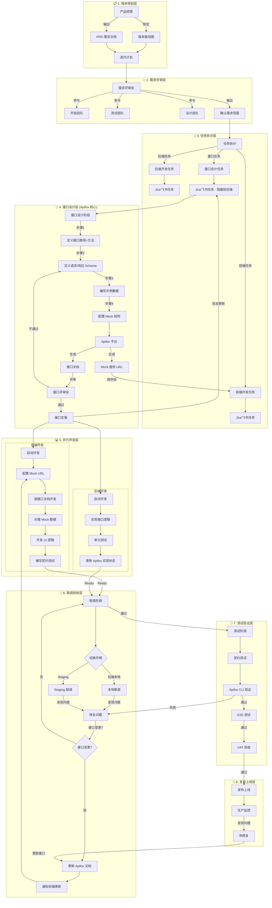
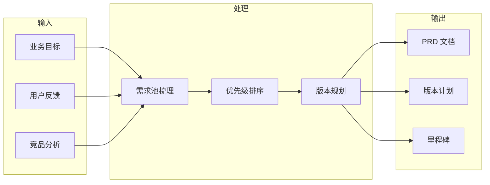
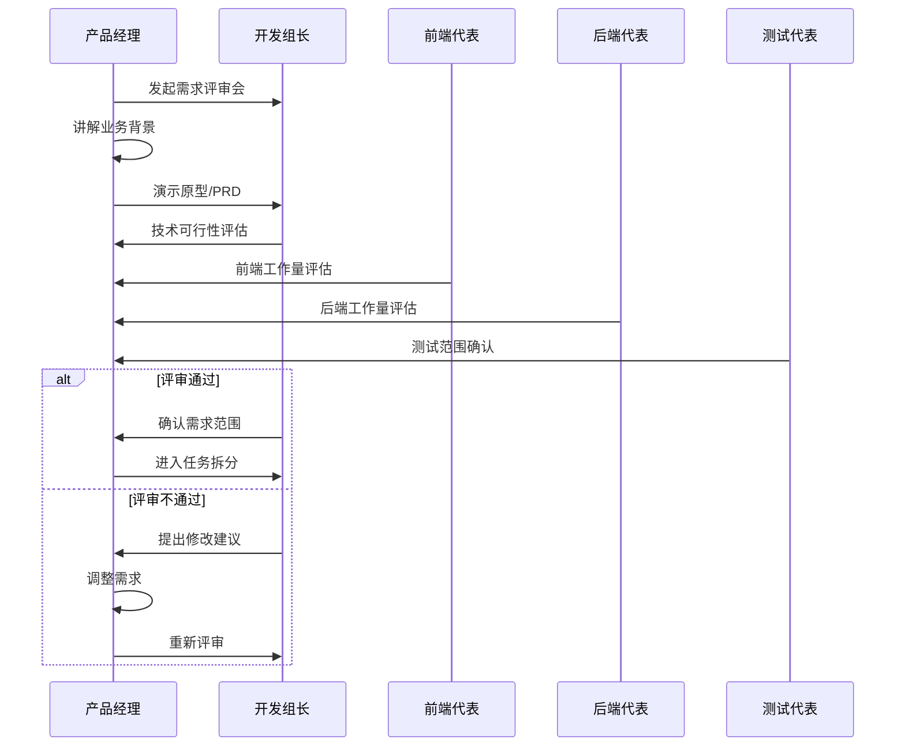
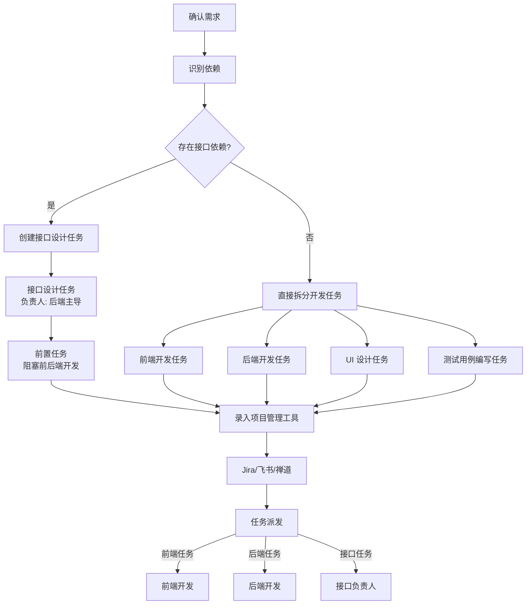
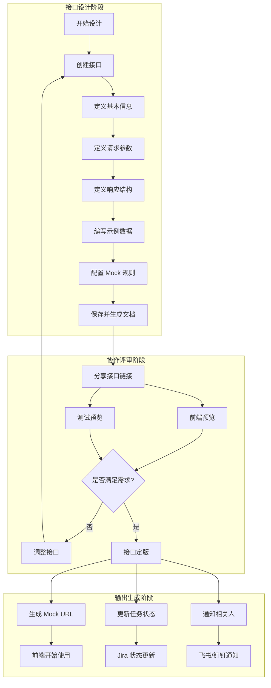
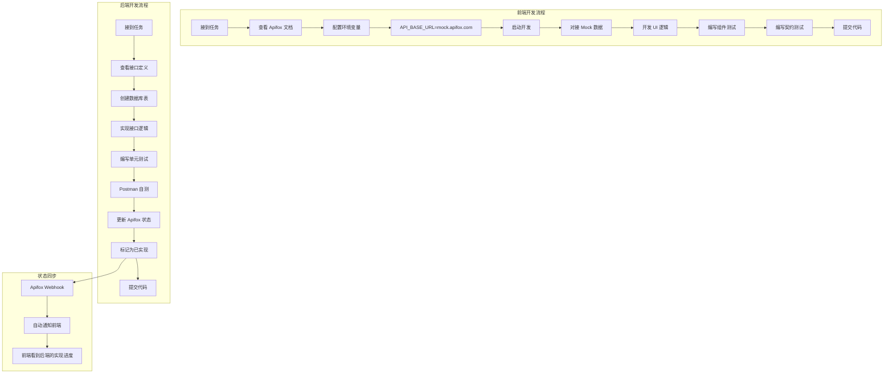
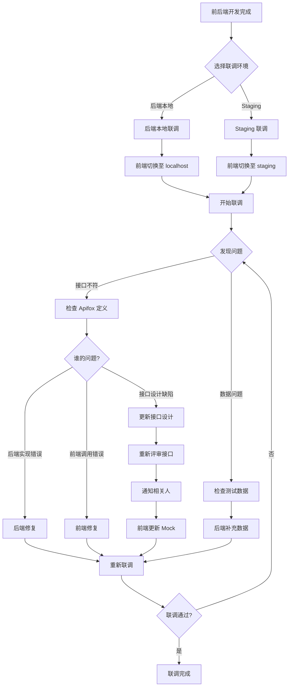
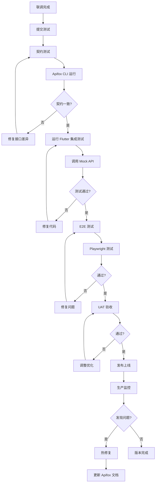
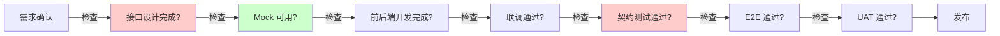
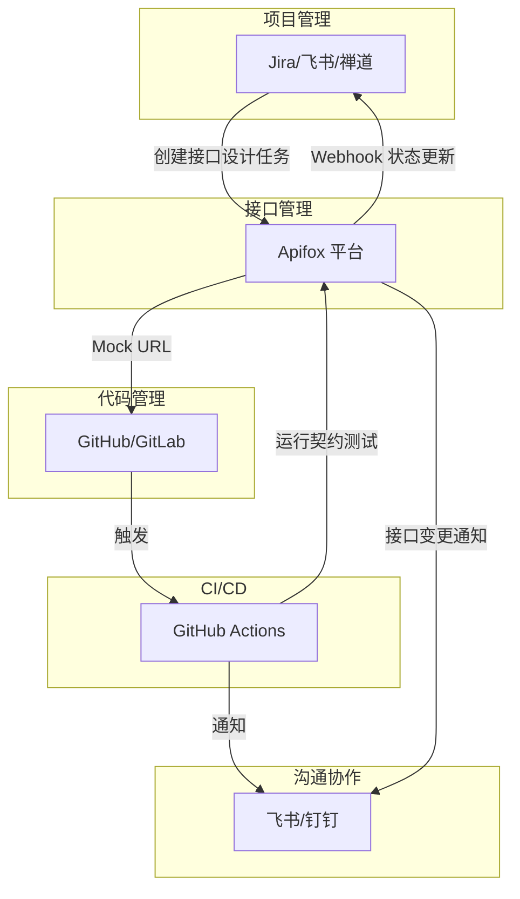

# 完整研发流程：从版本规划到接口管理

## 全景流程图



## 详细阶段说明

### 阶段 1: 版本规划



**负责人**: 产品经理
**输出物**:
- PRD 需求文档（功能清单、业务流程）
- 版本路线图
- 迭代计划（Sprint 规划）

### 阶段 2: 需求评审



**关键决策**:
- 哪些需求进入本次迭代
- 技术方案可行性
- 初步工作量评估

### 阶段 3: 任务拆分与派发



**项目管理工具配置**:
```yaml
任务类型:
  - 接口设计任务:
      负责人: 后端开发
      协作者: 前端开发
      阻塞: 前后端开发任务
      状态: 待设计 → 设计中 → 评审中 → 已完成
      
  - 前端开发任务:
      依赖: 接口设计完成
      触发条件: 接口状态 = 已完成
      
  - 后端开发任务:
      依赖: 接口设计完成
      并行: 可与前端同时进行
```

### 阶段 4: 接口设计（Apifox 核心流程）



**Apifox 操作步骤**:

```markdown
1. 创建接口
   - Path: /api/v1/order/create
   - Method: POST
   - 标签: 订单模块

2. 定义请求
   - Content-Type: application/json
   - Body Schema:
     ```json
     {
       "product_id": { "type": "integer", "required": true },
       "quantity": { "type": "integer", "minimum": 1 }
     }
     ```

3. 定义响应
   - 200: 成功
   - 400: 参数错误
   - 500: 服务器错误
   
4. 编写示例
   - 成功示例: { "code": 200, "data": { "order_id": 123 } }
   - 失败示例: { "code": 400, "message": "库存不足" }

5. 配置 Mock
   - 默认返回成功示例
   - 特定参数返回特定响应（如 quantity=999 返回库存不足）

6. 分享文档
   - 复制文档链接给前端
   - 复制 Mock URL 给前端配置
```

### 阶段 5: 并行开发



**前端配置示例**:
```dart
// lib/config/api_config.dart
class ApiConfig {
  static String get baseUrl {
    const env = String.fromEnvironment('API_ENV', defaultValue: 'mock');
    switch (env) {
      case 'mock':
        // Apifox Mock 服务
        return 'https://mock.apifox.com/m1/xxxxxx/default';
      case 'local':
        // 后端本地服务（联调时用）
        return 'http://localhost:8080';
      case 'staging':
        return 'https://api-staging.ttpos.com';
      default:
        return 'https://api.ttpos.com';
    }
  }
}
```

### 阶段 6: 联调验收



**环境切换命令**:
```bash
# 开发环境（Apifox Mock）
flutter run --dart-define=API_ENV=mock

# 联调环境（后端本地）
flutter run --dart-define=API_ENV=local

# 测试环境（Staging）
flutter run --dart-define=API_ENV=staging

# 生产环境
flutter run --dart-define=API_ENV=prod
```

### 阶段 7-8: 测试与发布



## 角色职责矩阵

| 阶段 | 产品经理 | 前端开发 | 后端开发 | 测试工程师 | Apifox 作用 |
|------|----------|----------|----------|------------|-------------|
| 需求规划 | ✅ 主导 | ⚪ 参与 | ⚪ 参与 | ⚪ 了解 | ❌ 无 |
| 需求评审 | ✅ 主讲 | ⚪ 评估 | ⚪ 评估 | ⚪ 评估 | ❌ 无 |
| 任务拆分 | ⚪ 确认 | ⚪ 接收 | ⚪ 接收 | ⚪ 接收 | ❌ 无 |
| **接口设计** | ❌ 不参与 | ⚪ 评审 | **✅ 主导** | ⚪ 了解 | **✅ 核心平台** |
| **Mock 开发** | ❌ 不参与 | **✅ 使用** | ⚪ 维护 | ❌ 不参与 | **✅ 提供 Mock** |
| **接口联调** | ❌ 不参与 | **✅ 参与** | **✅ 参与** | ⚪ 了解 | **✅ 对照标准** |
| 契约测试 | ❌ 不参与 | **✅ 编写** | ⚪ 配合 | **✅ 审核** | **✅ CLI 验证** |
| E2E 测试 | ❌ 不参与 | ⚪ 配合 | ⚪ 配合 | **✅ 主导** | ❌ 无 |
| 发布上线 | ✅ 主导 | ⚪ 配合 | ⚪ 配合 | **✅ 验证** | ❌ 无 |

## 关键检查点



**阻塞点**:
- 🔴 接口设计未完成 → 阻塞前后端开发
- 🔴 契约测试失败 → 阻塞合并代码
- 🟢 Mock 不可用 → 前端可先用静态数据开发

## 工具链整合



---

## 总结

整个流程的关键在于：**接口设计任务作为前后端的阻塞依赖，必须在开发前完成并经过评审。**

Apifox 在整个流程中扮演 **单一事实来源** 的角色：
1. 设计阶段：定义接口规范
2. 开发阶段：提供 Mock 服务
3. 联调阶段：作为对照标准
4. 测试阶段：验证契约合规
