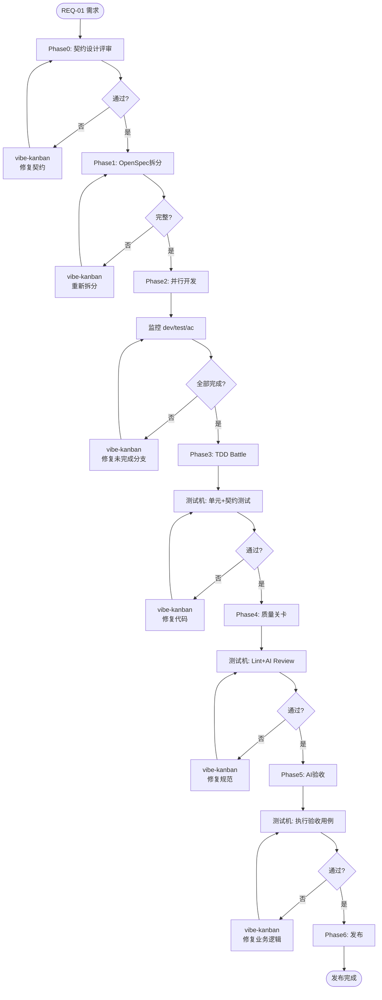

# 分布式 CI 架构设计

> 基于 n8n + vibe-kanban + 测试机 的 AI 驱动开发工作流

## 架构概述

```
┌─────────────────────────────────────────────────────────────────────────────┐
│                              n8n (调度器)                                    │
│  职责: 流程控制、阶段推进、决策判断                                           │
│                                                                              │
│   REQ-01 ──► P0契约 ──► P1拆分 ──► P2并行开发 ──► P3TDD ──► P4质量 ──► P5验收 ──► P6发布  │
│                │           │           │           │           │              │
│                ▼           ▼           ▼           ▼           ▼              │
│            [失败则调用 vibe-kanban 修复]                                       │
└─────────────────────────────────────────────────────────────────────────────┘
                                       │
                                       │ HTTP 调用修复
                                       ▼
┌─────────────────────────────────────────────────────────────────────────────┐
│                        vibe-kanban (开发机/执行器)                           │
│  职责: 写代码、修复、提交 (调用 Claude MCP)                                   │
│                                                                              │
│   接收修复指令 ──► Claude 分析 ──► 修改代码 ──► 本地验证 ──► git push ──► 返回结果  │
└─────────────────────────────────────────────────────────────────────────────┘
                                       │
                                       │ push 代码
                                       ▼
┌─────────────────────────────────────────────────────────────────────────────┐
│                           测试机 (卡点器)                                    │
│  职责: 跑测试、lint、验收，只返回 通过/失败                                   │
│                                                                              │
│   收到 push webhook ──► 跑 Lint ──► 跑 Test ──► 跑 Build ──► 返回结果给 n8n   │
└─────────────────────────────────────────────────────────────────────────────┘
                                       │
                                       │ webhook 触发
                                       ▼
┌─────────────────────────────────────────────────────────────────────────────┐
│                         Gitea/GitHub (归档器)                                │
│  职责: 存储代码、Issue、历史记录                                              │
│                                                                              │
│   ├── 代码仓库 (分支、提交)                                                   │
│   ├── Issues (CI 失败记录、修复历史)                                          │
│   └── Actions/Workflows (CI 配置)                                            │
└─────────────────────────────────────────────────────────────────────────────┘
```

## 职责分离

| 角色 | 职责 | 实体 | 当前环境 | 生产环境 |
|------|------|------|---------|---------|
| **调度器** | 流程控制、阶段推进、决策判断 | n8n | Kind 集群内 | 独立部署 |
| **执行器** | 写代码、修复、提交 | vibe-kanban | Kind 集群内 | 可扩展多节点 |
| **卡点器** | 跑测试、lint、验收 | Act Runner | Kind 集群内 (DinD) | K8s + 多 Runner |
| **归档器** | 存储代码、Issue、历史 | Gitea | Kind 集群内 | GitHub Enterprise |

## 开发流程 (6 阶段)



## 交互时序

```
1. n8n 触发测试机跑 CI
   n8n ──webhook──► 测试机

2. 测试机返回结果给 n8n
   测试机 ──webhook──► n8n

3. n8n 决定调用开发机修复
   n8n ──HTTP──► vibe-kanban

4. 开发机修复后 push 代码
   vibe-kanban ──git push──► Gitea

5. Gitea 触发测试机重新跑 CI
   Gitea ──webhook──► 测试机

6. 循环直到通过
```

## 各阶段详细说明

### Phase 0: 契约设计评审

**卡点器 (测试机)**:
- 检查契约规格文件是否存在
- 检查契约是否符合规范

**失败时 - 执行器 (开发机)**:
```bash
POST /api/fix-contract
# Claude 修改 contract.spec.yaml
# git commit & push
```

### Phase 1: OpenSpec 拆分

**卡点器 (测试机)**:
- 检查是否生成3份规格文件
- 检查规格完整性

**失败时 - 执行器 (开发机)**:
```bash
POST /api/fix-spec
# Claude 拆分需求
# 生成 dev.spec.md / contract.spec.yaml / ac.spec.yaml
# 提交到 specs/REQ-01/
```

### Phase 2: 并行开发

**卡点器 (测试机)**:
- 监控 dev/REQ-01, test/REQ-01, ac/REQ-01 分支状态
- 检查三方是否都标记为 done

**失败时 - 执行器 (开发机)**:
```bash
POST /api/fix-dev  # 修复 dev 分支
POST /api/fix-test # 修复 test 分支
POST /api/fix-ac   # 修复 ac 分支

# Claude 写代码/测试/验收用例
# git push 到对应分支
```

### Phase 3: TDD Battle

**卡点器 (测试机)**:
```yaml
# .gitea/workflows/tdd-battle.yml
jobs:
  tdd:
    runs-on: self-hosted-test
    steps:
      - run: make ci-lint
      - run: make ci-unit-test
      - run: make ci-contract-test
```

**失败时 - 执行器 (开发机)**:
```bash
POST /api/fix-tdd
# Claude 修复单元/契约测试
# make ci-test (本地验证)
# git push
```

### Phase 4: 质量关卡

**卡点器 (测试机)**:
```yaml
jobs:
  quality:
    runs-on: self-hosted-test
    steps:
      - run: golangci-lint run
      - run: semgrep --config=auto
      - run: ai-code-review
```

**失败时 - 执行器 (开发机)**:
```bash
POST /api/fix-quality
# Claude 修复 Lint 错误
# 重构复杂代码
# make ci-lint (本地验证)
# git push
```

### Phase 5: AI 验收

**卡点器 (测试机)**:
```yaml
jobs:
  acceptance:
    runs-on: self-hosted-test
    steps:
      - run: make ci-acceptance
```

**失败时 - 执行器 (开发机)**:
```bash
POST /api/fix-acceptance
# Claude 修复业务逻辑
# 通过验收用例
# git push
```

### Phase 6: 发布

**调度器 (n8n)**:
- 合并 feature/REQ-01 到 master
- 触发自动部署

## API 列表

### 开发机 (vibe-kanban) 提供

| API | 功能 | 输入 | 输出 |
|-----|------|------|------|
| `POST /api/fix-contract` | 修改契约规格 | `{req_id, contract_issues}` | `{status, commit}` |
| `POST /api/fix-spec` | OpenSpec 拆分 | `{req_id, prd_content}` | `{status, files[]}` |
| `POST /api/fix-dev` | 修复 dev 分支 | `{req_id, failed_tests}` | `{status, commit}` |
| `POST /api/fix-test` | 修复 test 分支 | `{req_id, failed_contracts}` | `{status, commit}` |
| `POST /api/fix-ac` | 修复 ac 分支 | `{req_id, missing_cases}` | `{status, commit}` |
| `POST /api/fix-tdd` | 修复单元/契约测试 | `{req_id, branch, failed_stages}` | `{status, commit}` |
| `POST /api/fix-quality` | 修复 Lint/AI Review | `{req_id, branch, lint_errors}` | `{status, commit}` |
| `POST /api/fix-acceptance` | 修复验收用例 | `{req_id, branch, failed_cases}` | `{status, commit}` |

### 测试机触发 n8n

| Webhook | 触发时机 |
|---------|---------|
| `POST n8n:/webhook/phase-done` | 各阶段完成 |
| `POST n8n:/webhook/ci-failed` | CI 失败 |
| `POST n8n:/webhook/quality-done` | 质量关卡完成 |
| `POST n8n:/webhook/acceptance-done` | 验收完成 |

## 实验环境 vs 生产环境

| 组件 | 实验环境 (当前) | 生产环境 |
|------|----------------|---------|
| **调度器** | Kind 内 n8n | 独立 n8n 集群 |
| **执行器** | Kind 内 vibe-kanban | K8s + 多 vibe-kanban 节点 |
| **卡点器** | Kind 内 Act Runner (DinD) | K8s + 多 Runner + 缓存 |
| **归档器** | Kind 内 Gitea | GitHub Enterprise |
| **网络** | ClusterIP | Ingress + HTTPS |
| **存储** | emptyDir/PVC | 分布式存储 |
| **监控** | 无 | Prometheus + Grafana |

## 实施路线图

### Phase 1: 基础搭建 (当前)
- [x] Kind 集群搭建
- [x] Gitea + Act Runner 部署
- [ ] n8n 部署
- [ ] vibe-kanban 部署

### Phase 2: 单阶段验证
- [ ] 实现 Phase 3 (TDD Battle) 完整闭环
- [ ] 验证: CI 失败 → n8n 调度 → vibe-kanban 修复 → 重新 CI

### Phase 3: 全阶段串联
- [ ] 实现 6 阶段完整工作流
- [ ] 端到端测试: 需求 → 发布

### Phase 4: 生产迁移
- [ ] Gitea → GitHub
- [ ] Kind → 生产 K8s
- [ ] 添加监控告警

## 快速开始

```bash
# 1. 启动实验环境
make start

# 2. 创建新需求
make req-create REQ_ID=REQ-01 TITLE="新功能"

# 3. 启动 n8n 工作流
make n8n-start

# 4. 触发开发流程
make dev-start REQ_ID=REQ-01
```

## 参考文档

- [AI 驱动测试工作流](./ai-driven-testing-workflow.md) - 详细阶段说明
- [n8n 工作流使用](./n8n-workflow-usage.md) - n8n 配置说明
- [完整开发工作流](./complete-development-workflow.md) - 分支策略
