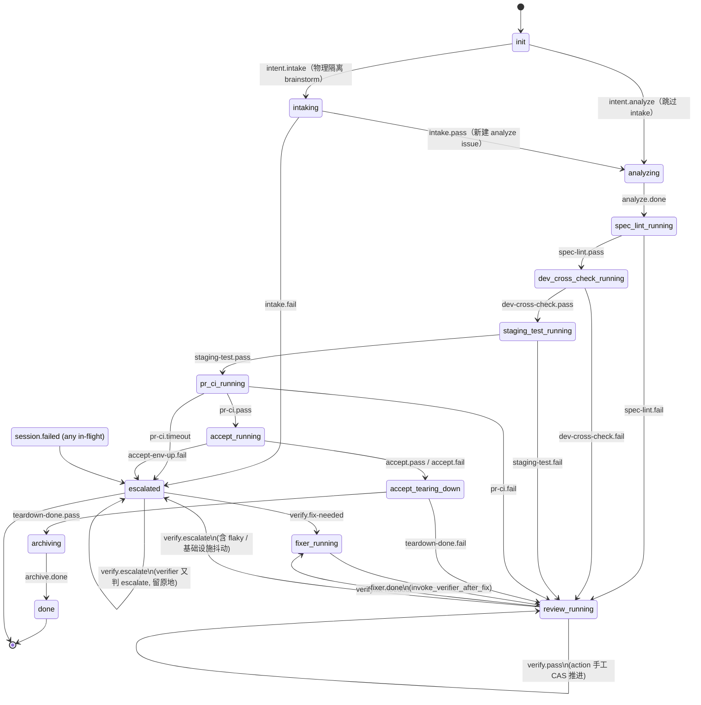

# Sisyphus 状态机

> 唯一真相源是 [orchestrator/src/orchestrator/state.py](../orchestrator/src/orchestrator/state.py)。
> 本文档把 `ReqState`、`Event`、`TRANSITIONS` 三个枚举可视化，方便看代码前先建立心智模型。
>
> 状态机当前形态：M14c + INTAKING —— verifier-agent 接管所有 stage fail 路径，旧 BUGFIX/DIAGNOSE 子链已砍。
> INTAKING 为物理隔离 brainstorm 阶段：intake-agent 只读代码 + 问问题，不能写实现。

## 1. 设计要点

- **每个 REQ 同一时刻只在一个 state**。store 表 `req_state` 行级 CAS 保并发（`store/req_state.py`）。
- **transition 是 (state, event) → (next_state, action)** 的纯映射；非法组合直接 skip + log。
- **action 异步副作用**：起 BKD issue / 跑 checker / 写表 / emit 后续 event。idempotent action 标 `idempotent=True`，create_* 那种不幂等的会防重复触发。
- **CAS 失败 = 并发抢同 REQ**：另一个 webhook 已推过 state，本次 skip。
- **terminal state 只有 2 个**：`done`（archive 完）和 `escalated`（人介入 / lab 起不来 / verifier 投降）。
- **多仓 (M16)**：state name 不变；`spec-lint-running` / `dev-cross-check-running` /
  `staging-test-running` 三个 checker stage 内部从单仓变成 for-each-repo 遍历
  （任一仓红 → stage fail）。状态机层面无影响。

## 2. ReqState 枚举（16 个）

| state | 含义 | 类型 |
|---|---|---|
| `init` | 还没 analyze（intent_analyze 之前） | start |
| `intaking` | **INTAKING** intake-agent 在跑（多轮 BKD chat 澄清 + 写 finalized intent） | in-flight |
| `analyzing` | analyze-agent 在跑 | in-flight |
| `spec-lint-running` | **M15** 客观检查：**for-each-repo** openspec validate + check-scenario-refs.sh（遍历 `/workspace/source/*`） | in-flight |
| `dev-cross-check-running` | **M15** 客观检查：**for-each-repo** 业务 repo 自定义检查（make dev-cross-check） | in-flight |
| `staging-test-running` | **for-each-repo 并行** 跑 make ci-test（机械） | in-flight |
| `pr-ci-running` | PR 已开，等 GHA 全套绿（机械） | in-flight |
| `accept-running` | env-up 完，accept-agent 跑 FEATURE-A* | in-flight |
| `accept-tearing-down` | env-down 清 lab（无论 accept pass/fail 都跑） | in-flight |
| `review-running` | **M14b** verifier-agent 在跑（success / fail 两触发统一入口） | in-flight |
| `fixer-running` | **M14b** decision=fix → 起对应 fixer agent | in-flight |
| `archiving` | done-archive agent 跑（合 PR + 关 issue） | in-flight |
| `gh-incident-open` | （已规划，未启用）GitHub issue 已开等人 | wait-human |
| **`done`** | REQ 完成 | **terminal** |
| **`escalated`** | 熔断 / session-failed / 人工止损 | **terminal** |

## 3. Event 枚举（25 个）

| event | 来源 | 触发什么 |
|---|---|---|
| **`intent.intake`** | 人在 BKD 打 `intent:intake` tag | start_intake（物理隔离 brainstorm） |
| **`intake.pass`** | intake-agent PATCH `result:pass` + finalized intent JSON 解析成功 | start_analyze_with_finalized_intent |
| **`intake.fail`** | intake-agent PATCH `result:fail` / 或 finalized intent JSON 解析失败 | escalate |
| `intent.analyze` | 人在 BKD 打 `intent:analyze` tag（跳过 intake 直接进 analyze） | start_analyze |
| `analyze.done` | analyze-agent session.completed | create_spec_lint |
| **`spec-lint.pass`** | **M15** spec-lint checker 退码 0 | create_dev_cross_check |
| **`spec-lint.fail`** | **M15** spec-lint checker 退码非 0 | invoke_verifier_for_spec_lint_fail |
| **`dev-cross-check.pass`** | **M15** dev-cross-check checker 退码 0 | create_staging_test |
| **`dev-cross-check.fail`** | **M15** dev-cross-check checker 退码非 0 | invoke_verifier_for_dev_cross_check_fail |
| `dev.done` | dev-agent session.completed | （aggregated as DEV_ALL_PASSED） |
| `staging-test.pass` | M1 checker 退码 0 | create_pr_ci_watch |
| `staging-test.fail` | M1 checker 退码非 0 | invoke_verifier_for_staging_test_fail |
| `pr-ci.pass` | M2 checker 全绿 | create_accept |
| `pr-ci.fail` | M2 checker 任一红 | invoke_verifier_for_pr_ci_fail |
| `pr-ci.timeout` | M2 checker 超时 | escalate（PR repo 可能没配 CI） |
| `accept-env-up.fail` | create_accept 内部 emit | escalate（lab 起不来） |
| `accept.pass` | accept-agent 写 result:pass tag | teardown_accept_env |
| `accept.fail` | accept-agent 写 result:fail tag | teardown_accept_env |
| `teardown-done.pass` | 上一个是 accept.pass 的 teardown 完 | done_archive |
| `teardown-done.fail` | 上一个是 accept.fail 的 teardown 完 | invoke_verifier_for_accept_fail |
| `archive.done` | done_archive agent session.completed | （进入 done） |
| `session.failed` | 任意 stage agent session 崩 / watchdog 超时 | escalate |
| **`verify.pass`** | M14b verifier decision=pass | apply_verify_pass（手工 CAS 推进下一 stage） |
| **`verify.fix-needed`** | M14b verifier decision=fix | start_fixer |
| **`verify.escalate`** | M14b decision=escalate / schema invalid（含基础设施 flaky）| escalate |
| **`fixer.done`** | fixer agent session.completed | invoke_verifier_after_fix |

## 4. 完整状态转移图



> mermaid `stateDiagram-v2` 用 `_` 替 `-` 是因为 stateName 不允许 `-`。实际 enum 是 `spec-lint-running` / `dev-cross-check-running` / `staging-test-running` / `pr-ci-running` / `review-running` 等。

## 5. verifier 子链特殊性（M14b/c）

3 路决策：**pass / fix / escalate**（retry_checker 已砍 —— 基础设施 flaky 由 verifier 判
escalate 给人，sisyphus 不机制性兜 retry，避免假阳性 retry 死循环）。

**ESCALATED 可恢复**：用户在 BKD UI follow-up 那条 escalate 的 verifier issue（webhook
统一推 statusId="review" 让"待审查"列只剩它）→ BKD wake agent → 写新 decision → 走原
verifier session.completed 同一套 webhook 链路，直接命中 `(ESCALATED, VERIFY_*)` transition。
零新概念 / 零新 tag / 零新 endpoint。**注意**只可 follow-up verifier issue 续；analyze
issue 续会重起整个 analyze 等于新 REQ，文档不推荐。

`VERIFY_PASS` 在 transition 表里看起来是 self-loop（next_state 还是 `review-running`），
但 **action 内部手工 CAS 推到目标 stage_running 再链式 emit 该 stage 的 done/pass 事件**。
这是因为目标 stage 由 verifier issue 的 `verify:<stage>` tag 决定，transition 表静态表达不了。

具体见 [actions/_verifier.py](../orchestrator/src/orchestrator/actions/_verifier.py)：

```
apply_verify_pass:
  REVIEW_RUNNING --CAS--> {stage}_RUNNING
  emit {stage}.done / .pass
  → 走原主链 transition 推下一 stage

start_fixer:
  REVIEW_RUNNING --CAS--> FIXER_RUNNING
  起 BKD fixer issue（dev / spec），异步等 session.completed → invoke_verifier_after_fix
```

## 6. CAS 失败如何处理

`store/req_state.cas_transition(pool, req_id, expected_state, target_state, event, action)` —— 行级 UPDATE WHERE state=expected。返回 False 表示并发抢占：

- transition 直接 skip（不 emit、不报错），日志 `*.cas_failed`
- 上层 webhook handler 也 skip 重复回放
- 这是 idempotency 的最后一道防线

## 7. INTAKING 设计动机：两 agent 物理隔离

**问题**：analyze-agent 在一个 session 内完成 brainstorm + spec + 代码 + PR。对不熟悉的仓，
LLM 有强烈的行动 bias，即使 prompt 要求"先 brainstorm"也会绕过用户意见直接开干。

**方案**：把 brainstorm 拆成独立 agent stage（INTAKING），物理上限制它**只能读代码 + 问问题**，
不能写实现 / 开 PR / push。用户在 BKD chat 多轮对话直到满意，intake-agent 输出 finalized intent JSON 后 PATCH `result:pass`，sisyphus 才在新 BKD issue 起 analyze-agent 接力。

**物理隔离的含义**：
- intake issue 只有 `intake` tag → analyze 的 prompt 不会出现（agent 没有 "出口"）
- analyze-agent 是在全新 issue 里起来的，不知道也不能访问 intake issue 的 session 工具
- finalized intent JSON 经 sisyphus 解析验证（6 必填字段）后注入 analyze prompt

**跳过 intake**：用 `intent:analyze` tag 而非 `intent:intake` → 直接进 ANALYZING（trivial REQ 不需要澄清）。两条路在状态机里是独立 transition，互不干扰。

## 8. session.failed 兜底

任何 in-flight state 收到 `session.failed`（agent 崩 / watchdog 判超时）→ 直接 ESCALATED。

watchdog (M8) 把"BKD session 卡 N 秒不动"翻译成 SESSION_FAILED 喂回状态机：
- 后台轮 `req_state` 表
- 选 in-flight state + `updated_at > threshold`
- 查关联 BKD issue 的 session 状态：不在 running → emit SESSION_FAILED

## 9. 怎么在状态机加新 stage / event

1. 在 `state.py` 加 `ReqState` 枚举值
2. 加对应 `Event` 枚举值
3. 写 `actions/<new>.py`，`@register("action_name")` 装饰，签名 `(*, body, req_id, tags, ctx) → dict`
4. 在 `TRANSITIONS` 加 (state, event) → Transition 行
5. router.py 加 tag → Event 翻译（如果是新 agent role）
6. 不忘：观测系统 — `stage_runs` 表自动入；新 agent 类型加 `verifier/<stage>_*.md.j2` prompt（如果走 verifier 框架）

## 10. 调试 tip

```python
# REPL: 把当前 transition 表 dump 成 markdown，方便对照
from orchestrator.state import dump_transitions
print(dump_transitions())
```

```sql
-- 找卡死 REQ：in-flight state + 30 min 没动
SELECT req_id, state, updated_at, context->>'verifier_stage' AS stage
FROM req_state
WHERE state NOT IN ('done', 'escalated', 'init', 'gh-incident-open')
  AND updated_at < NOW() - INTERVAL '30 minutes'
ORDER BY updated_at;

-- 看一个 REQ 的事件历史
SELECT ts, kind, router_action, exit_code
FROM event_log
WHERE req_id = 'REQ-29'
ORDER BY ts;
```
