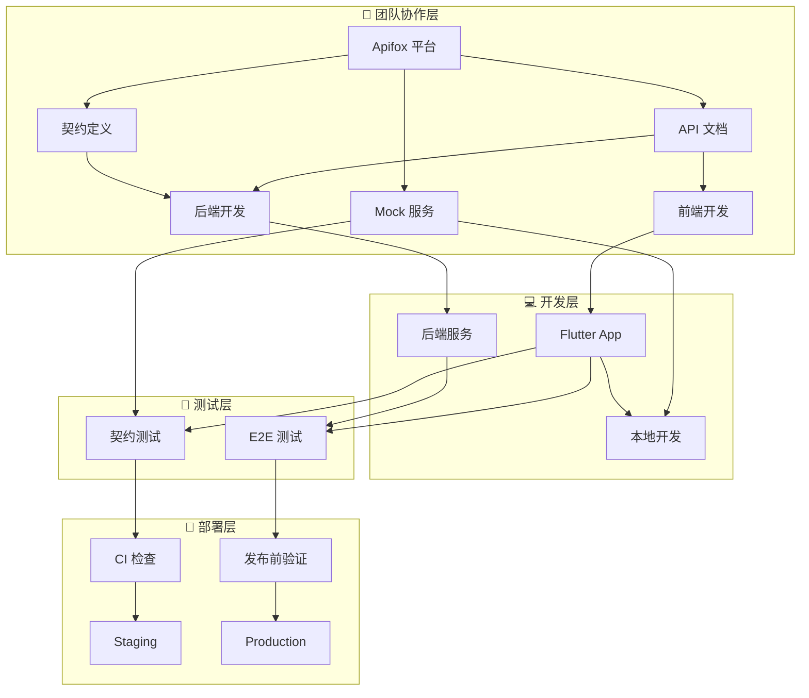
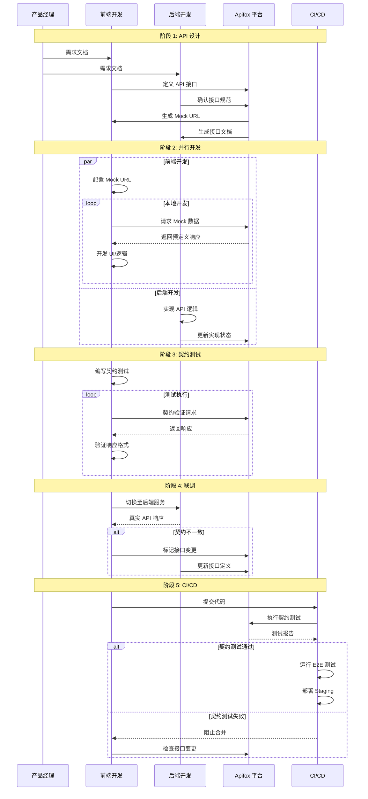
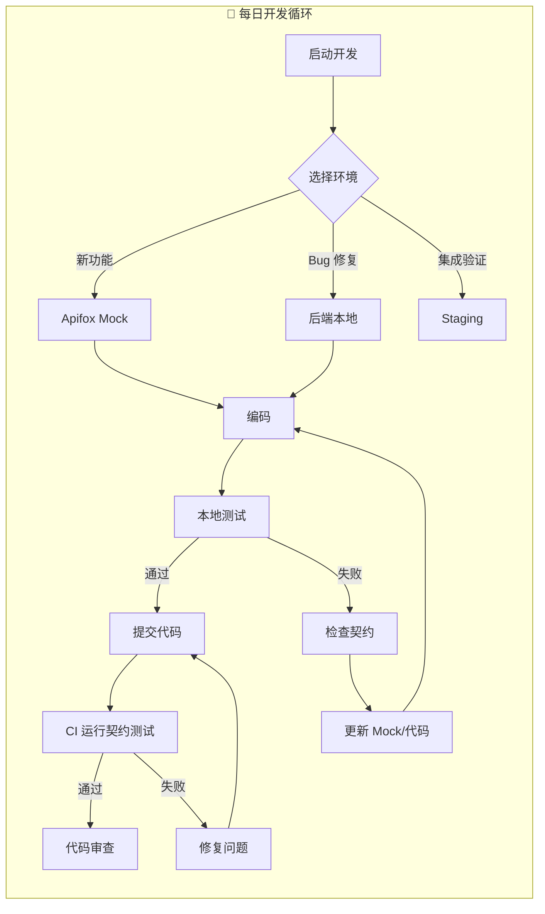
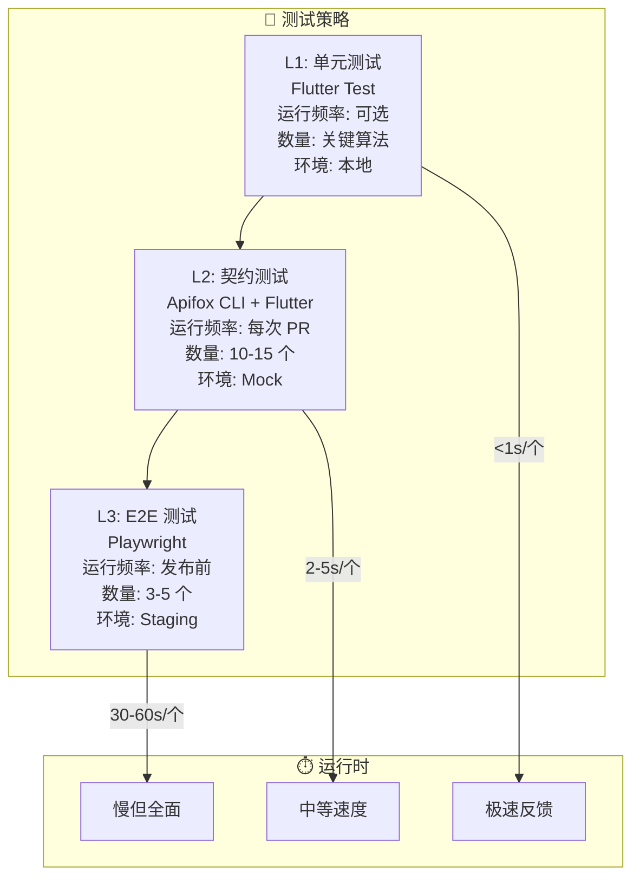
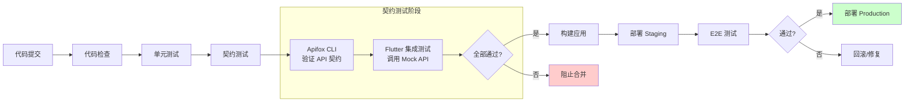
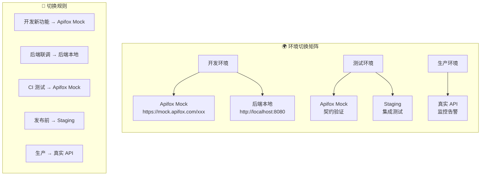
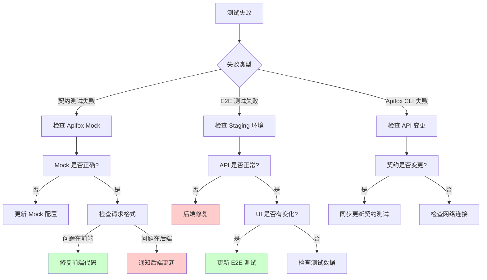
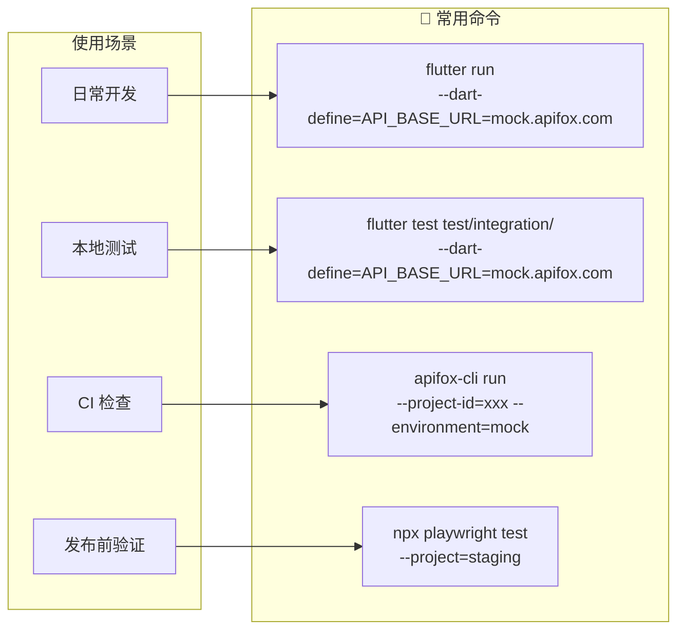

# Apifox 契约测试完整工作流

## 整体架构

## 详细工作流程

## 开发工作流

## 测试金字塔（Apifox 版）

## CI/CD 流水线

## 环境切换策略

## 角色职责

```mermaid
flowchart TB
    subgraph 前端开发["👨‍💻 前端开发"]
        FE1[查看 API 文档<br/>Apifox 平台]
        FE2[配置 Mock URL<br/>开发调试]
        FE3[编写契约测试<br/>验证响应格式]
        FE4[运行测试<br/>flutter test]
        
        FE1 --> FE2 --> FE3 --> FE4
    end

    subgraph 后端开发["👨‍💻 后端开发"]
        BE1[实现 API<br/>按契约开发]
        BE2[更新实现状态<br/>Apifox 标记]
        BE3[通知前端<br/>联调准备]
        
        BE1 --> BE2 --> BE3
    end

    subgraph 测试/QA["🧪 测试/QA"]
        QA1[编写 E2E 测试<br/>Playwright]
        QA2[验证契约<br/>Apifox CLI]
        QA3[Staging 验收<br/>发布前检查]
        
        QA1 --> QA2 --> QA3
    end

    subgraph 自动化["🤖 CI/CD"]
        CI1[拉取代码]
        CI2[运行 Apifox CLI<br/>契约验证]
        CI3[运行 Flutter 契约测试]
        CI4[运行 E2E 测试]
        CI5[部署/阻止]
        
        CI1 --> CI2 --> CI3 --> CI4 --> CI5
    end
```

## 问题排查流程

## 完整命令参考

---

## 工作流总结

| 阶段 | 工具 | 输出 | 责任人 |
|------|------|------|--------|
| API 设计 | Apifox | 接口文档 + Mock | 前后端协商 |
| 并行开发 | Apifox Mock | 可运行的前端 | 前端开发 |
| 契约测试 | Flutter + Apifox | 测试报告 | 前端开发 |
| CI 验证 | Apifox CLI | 通过/失败 | 自动化 |
| E2E 测试 | Playwright | 发布许可 | QA/自动化 |
| 部署 | GitHub Actions | 上线 | 自动化 |
