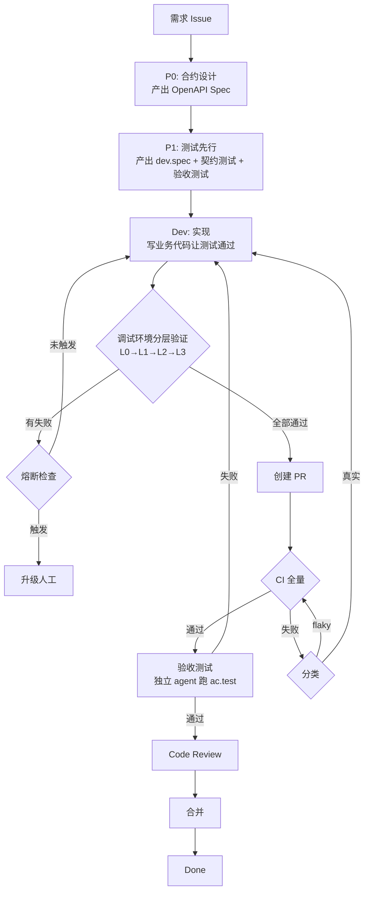

# 工作流 V2 架构设计

> AI 驱动的无人值守开发工作流。契约驱动 + 测试先行，OpenAPI Spec 为唯一真相源。

## 核心哲学

**契约驱动开发（CDD）+ 测试驱动开发（TDD）**：

```
需求 → 合约（OpenAPI Spec）→ 测试代码 → 业务代码 → 验证
        ↑ 唯一真相源          ↑ LOCKED        ↑ 全自动
        ↑ 有歧义就停下来问     ↑ 锁定后不再修改  ↑ 无人值守
```

**两段式流程**：

```
┌─ 有人阶段（人机协作）──────────────────────────────────────┐
│  需求 → P0 合约设计 → P1 测试先行                          │
│  合约要拆到没有歧义。有问题在这里停下来问用户。               │
│  一旦合约和测试锁定，后面就不需要人了。                      │
├─ 分界线 ─────────────────────────────────────────────────┤
│  无人阶段（全自动）                                        │
│  Dev 实现 → 分层验证 → PR/CI → 验收测试 → 合并归档         │
│  全程无人值守，熔断兜底。                                   │
└──────────────────────────────────────────────────────────┘
```

## 核心原则

- **目标**：加速开发，走向无人值守
- **约束**：每个节点只做一件事，不搞花里胡哨
- **硬约束**：开发环境只能通过 aissh MCP 连接调试环境
- **CDD 约束**：合约是唯一真相源，合约有歧义必须在 P0/P1 阶段解决，不能带着模糊需求进入开发
- **TDD 约束**：测试先于实现，测试代码一旦产出即锁定，Dev 不能修改测试

## 架构概览：三环模型

```
开发环境（写代码+控制）→ 调试环境（验证）→ GitHub（最终门禁）
```

- **开发环境**：AI 写代码，n8n 编排，BKD 执行，aissh 远程操控调试环境
- **调试环境**：纯被动执行，分层验证，K8s namespace 隔离
- **GitHub**：CI 全量一把梭 + 验收测试 + Code Review

## 流程全景

```
┌─────────────────────────────────────────────────────────────────┐
│  P0: 合约设计                                                   │
│  输入: 需求描述                                                  │
│  输出: OpenAPI Spec (contract.spec.yaml)                        │
│  原则: 只定义接口边界，不写任何代码                                │
└──────────────────────────┬──────────────────────────────────────┘
                           ↓
┌─────────────────────────────────────────────────────────────────┐
│  P1: 测试先行                                                   │
│  输入: OpenAPI Spec                                             │
│  输出:                                                          │
│    ├── dev.spec.md          实现指南（给 Dev agent 看）           │
│    ├── contract.test.*      契约测试代码（验证 API schema）       │
│    └── ac.test.*            验收测试代码（Given/When/Then）       │
│  原则: 只写测试，不写业务代码。测试产出即 LOCKED。                  │
└──────────────────────────┬──────────────────────────────────────┘
                           ↓
┌─────────────────────────────────────────────────────────────────┐
│  Dev: 实现                                                      │
│  输入: dev.spec.md + 已有的测试代码                               │
│  输出: 业务代码 + 单元测试                                       │
│  原则: 只写业务代码，不能修改 contract.test 和 ac.test            │
│  验证: 在调试环境跑分层测试                                       │
│    L0: 静态检查（lint, type check, compile）                     │
│    L1: 单元测试                                                  │
│    L2: 契约测试（contract.test.*）                               │
│    L3: 集成测试                                                  │
│  全部通过才能进入下一阶段                                         │
└──────────────────────────┬──────────────────────────────────────┘
                           ↓
┌─────────────────────────────────────────────────────────────────┐
│  PR + CI                                                        │
│  创建 PR → CI 全量跑 → 失败分类（flaky/真实）                    │
│  flaky → retry    真实失败 → 回 Dev                              │
└──────────────────────────┬──────────────────────────────────────┘
                           ↓
┌─────────────────────────────────────────────────────────────────┐
│  验收测试                                                       │
│  执行者: 独立 agent（无开发上下文）                               │
│  输入: ac.test.*（LOCKED）+ 部署完整环境                         │
│  输出: 验收报告（通过/失败 + 证据）                               │
│  失败 → 回 Dev                                                  │
└──────────────────────────┬──────────────────────────────────────┘
                           ↓
                    Code Review → 合并 → Done
```

## 每个节点的产出和约束

### P0: 合约设计（有人阶段）

| 项目 | 说明 |
|------|------|
| **输入** | 需求描述（自然语言） |
| **输出** | `contract.spec.yaml`（OpenAPI 3.0+ 规范） |
| **做什么** | 定义 endpoint paths, methods, request/response schemas, error codes |
| **不做什么** | 不写任何代码，不写测试 |
| **质量门控** | Spec 必须包含：路径、方法、请求体 schema、响应体 schema、错误响应 |
| **歧义处理** | 需求不清晰时**必须停下来问用户**，不能猜测。合约是后续一切的基础，模糊的合约 = 返工 |

P0 的核心价值：**把问题提前暴露**。宁可在合约阶段多花时间和用户对齐，也不要带着模糊需求进入无人阶段。

### P1: 测试先行（有人阶段）

| 项目 | 说明 |
|------|------|
| **输入** | `contract.spec.yaml` |
| **输出** | `dev.spec.md` + `contract.test.*` + `ac.test.*` |
| **做什么** | 1. 拆解实现指南（尽可能详细） 2. 编写契约测试代码 3. 编写验收测试代码 |
| **不做什么** | 不写业务代码 |
| **LOCKED** | `contract.test.*` 和 `ac.test.*` 一旦产出，后续阶段不能修改 |
| **歧义处理** | 合约拆解中发现问题（缺字段、逻辑矛盾、边界不清）**必须停下来问用户**，不能假设 |

P1 是有人阶段的最后关卡。P1 完成 = 合约锁定 + 测试锁定 = 进入无人值守。`dev.spec.md` 要写到 Dev agent 不需要猜的程度。

**contract.test（契约测试）**：
- 基于 OpenAPI Spec 验证 API schema
- 请求格式是否符合 spec
- 响应格式是否符合 spec
- 状态码是否正确
- 必填字段是否存在

**ac.test（验收测试）**：
- Given/When/Then 格式
- 覆盖正常路径和异常路径
- 端到端场景验证
- 由独立 agent 在干净环境执行

### Dev: 实现

| 项目 | 说明 |
|------|------|
| **输入** | `dev.spec.md` + 已有的测试代码（只读） |
| **输出** | 业务代码 + 单元测试 |
| **做什么** | 写代码让所有测试通过 |
| **不做什么** | 不修改 `contract.test.*` 和 `ac.test.*` |
| **验证** | 在调试环境跑 L0-L3 分层测试 |

### 验证: 分层测试

| 层级 | 内容 | 失败处理 |
|------|------|---------|
| L0 | 静态检查（lint, compile） | 立即回 Dev 修 |
| L1 | 单元测试（Dev 自己写的） | 立即回 Dev 修 |
| L2 | 契约测试（P1 写的，LOCKED） | 回 Dev 修业务代码 |
| L3 | 集成测试 | 回 Dev 修 |

### 验收: 独立验证

| 项目 | 说明 |
|------|------|
| **执行者** | 独立 agent，无开发过程上下文 |
| **输入** | `ac.test.*`（LOCKED）+ 部署完整环境 |
| **环境** | 干净 namespace，完整服务栈 |
| **输出** | 验收报告（场景通过率 + 证据） |

## 流程图



## 职责划分

| 角色 | 职责 | 不做什么 |
|------|------|---------|
| **n8n** | 主编排：阶段推进、回调路由、熔断判断 | 不写代码、不做 AI 判断 |
| **BKD** | AI 执行引擎：管理 issue、启动 agent、日志 | 不做阶段决策 |
| **Claude agent** | 写代码/测试、通过 aissh 操控调试环境 | 不做阶段决策、不修改 LOCKED 文件 |
| **aissh MCP** | 唯一桥梁：远程操控调试环境 | 不做逻辑判断 |
| **调试环境** | 纯执行：拉代码、setup、跑测试、返回结果 | 不修代码 |
| **OpenAPI Spec** | 唯一真相源：定义接口边界 | 产出后不修改 |

## 两层编排

| 层级 | 谁负责 | 粒度 | 例子 |
|------|--------|------|------|
| 主编排 | n8n | 粗粒度，管阶段推进 | P0→P1→Dev→验证→PR→验收 |
| 小编排 | AI agent | 细粒度，管具体实现 | 拆文件、写测试、处理依赖、跑验证 |

n8n 管"做什么、什么顺序"，AI 管"具体怎么做"。

## n8n 工作流架构

采用事件驱动回调模式，每个阶段一个独立工作流：

| Webhook | 触发时机 | 动作 |
|---------|---------|------|
| `/v2` | 入口 | 创建 P0 issue，发送需求 prompt |
| `/v2-p0-done` | P0 agent 完成 | 创建 P1 issue，发送 Spec + 测试编写要求 |
| `/v2-p1-done` | P1 agent 完成 | 创建 Dev issue，发送 dev.spec + 测试代码路径 |
| `/v2-dev-done` | Dev agent 完成 | 检查测试结果，通过→创建 PR，失败→熔断检查 |
| `/v2-ci-done` | CI 完成 | 通过→创建验收 issue，失败→分类处理 |
| `/v2-accept-done` | 验收完成 | 通过→设 review，失败→回 Dev |

每个工作流通过 BKD MCP 创建 issue + follow-up + 触发执行，agent 完成后回调下一个 webhook。

## 数据流

| 阶段 | 输入 | 产出 | 传递方式 |
|------|------|------|---------|
| P0 | 需求描述 | contract.spec.yaml | git commit |
| P1 | contract.spec.yaml | dev.spec.md, contract.test.*, ac.test.* | git commit |
| Dev | dev.spec.md, tests | 业务代码, 单元测试 | git commit |
| 验证 | 代码 + 测试 | L0-L3 结果 | aissh MCP |
| CI | PR | 全量测试结果 | GitHub API |
| 验收 | ac.test.* + 环境 | 验收报告 | BKD issue log |

代码传输走 **git push/pull**，控制走 **aissh MCP**，编排走 **n8n webhook 回调**。

## 关键机制

### 1. 测试锁定（LOCKED）

P1 产出的 `contract.test.*` 和 `ac.test.*` 一旦 commit，后续阶段的 agent prompt 明确禁止修改这些文件。n8n 在 Dev 完成后可以检查这些文件是否被改动（git diff），改了就拒绝。

### 2. 熔断

```
每次 Dev 失败 → 轮次 +1 → 检查：
  1. 修复轮数 ≥ 3
  2. 累计耗时超限
  3. 累计 token 消耗超限

任一触发 → 停止 → 挂 Issue 升级人工
```

n8n 做判断，通过 webhook 入参传递轮次和累计数据。

### 3. AI 心跳

BKD 内置进程监控。agent 超时未完成 → BKD 自动标记失败 → 触发回调。

### 4. 冲突预检

n8n 分发 Dev 任务前，检查目标文件是否被其他活跃任务占用。

### 5. 并发池

BKD `get-processes-capacity` 检查可用槽位，超限排队。

### 6. 串行合并窗口

多个 PR 通过验证后，串行化合并到主分支。

### 7. CI 失败分类

| 类型 | 处理 |
|------|------|
| flaky test | 直接 retry |
| 真实失败 | 回 Dev 走修复流程 |

### 8. 验收测试隔离

独立 agent，不带开发过程记忆。复用或新建 namespace，部署完整服务栈，执行 LOCKED 的 ac.test.*。

## 可观测性

BKD issue 记录每个阶段的：
- 产出物（Spec、测试代码、业务代码）
- 测试结果（哪层失败、错误日志）
- 修复轮次和 diff
- token 消耗和耗时
- 回调状态

n8n execution 记录编排层的：
- 每个 webhook 触发和响应
- 每个 BKD MCP 调用结果
- 阶段推进路径

## 每个节点的存在理由

| 节点 | 为什么需要 | 去掉会怎样 |
|------|-----------|-----------|
| P0 合约设计 | AI 写代码前必须知道边界 | 返工率爆炸 |
| P1 测试先行 | 测试锁定防 AI 自己出题自己答 | 验收失去意义 |
| 契约测试 | 验证 API 是否符合 Spec | 接口不一致到集成才发现 |
| 验收测试 | 验证业务逻辑是否正确 | 技术通了但业务是错的 |
| Dev 实现 | 核心价值 | — |
| 分层验证 | 快速定位问题层级 | 每次跑全套，反馈慢 |
| 熔断 | AI 卡住了继续烧没意义 | 死循环烧 token |
| CI 全量 | 组合问题需要兜底 | 漏掉组合问题 |
| CI 失败分类 | flaky 不值得走完整修复 | 浪费整轮循环 |
| 串行合并 | 避免并行 PR 互踩 | 合并冲突 |
