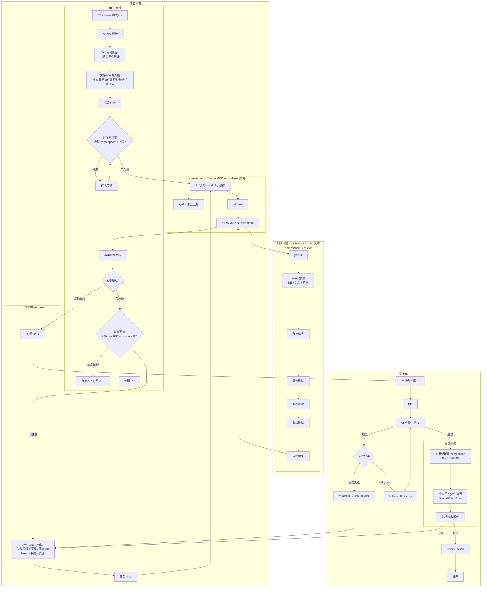

# 工作流 V2 架构设计

> AI 驱动的无人值守开发工作流。加速开发，每个节点都有存在的理由。

## 核心原则

- **目标**：加速开发，走向无人值守
- **约束**：不搞花里胡哨的流程节点，每一个节点必须有意义
- **硬约束**：开发环境只能通过 aissh MCP 连接调试环境

## 架构概览：三环模型

```
开发环境（写代码+控制）→ 调试环境（验证）→ GitHub（最终门禁）
```

- **开发环境**：AI 写代码，n8n 编排，aissh 远程操控调试环境
- **调试环境**：纯被动执行，分层验证，K8s namespace 隔离
- **GitHub**：CI 全量一把梭 + 验收测试 + Code Review

## 流程图



## 职责划分

| 角色 | 职责 | 不做什么 |
|------|------|---------|
| **n8n** | 主编排：阶段控制、任务分发、结果收集、熔断判断、并发池管理 | 不写代码、不直接操作调试环境 |
| **vibe-kanban + Claude** | 写代码（worktree 直接操作）、小编排用 skill 自己搞、git push、通过 aissh 操控调试环境 | 不做阶段决策 |
| **aissh MCP** | 唯一桥梁：开发环境远程操控调试环境（拉代码、setup、触发、读结果） | 不做逻辑判断 |
| **调试环境** | 纯执行：拉代码、setup、分层跑验证、返回结果 | 不修代码、不做决策 |
| **Issue** | 可观测性：记录 AI 卡在哪、怎么卡、修了几轮、每轮改了什么 | 不是流程控制工具 |
| **GitHub CI** | 最终门禁：全量一把梭验证 | 不做分层 |

## 两层编排

| 层级 | 谁负责 | 粒度 | 例子 |
|------|--------|------|------|
| 主编排 | n8n | 粗粒度，管阶段推进 | P0→P1→分发→收集→决策→PR |
| 小编排 | AI skill | 细粒度，管具体实现 | 拆文件、生成测试、处理依赖、自检 |

n8n 管"做什么、什么顺序"，AI 管"具体怎么做"。

## 隔离方案

| 层级 | 隔离方式 | 效果 |
|------|---------|------|
| 开发环境 | git worktree | 功能 A、B 各自独立 worktree，代码互不干扰 |
| 调试环境 | K8s namespace + ResourceQuota + LimitRange | 每个功能独立 namespace，完整依赖，天然网络隔离，资源受限 |
| 验收测试 | 独立子 agent | 干净上下文，不受开发过程污染 |

## 数据流

| 通道 | 用途 |
|------|------|
| git push/pull | 代码传输 |
| aissh MCP | 控制通道（唯一桥梁，硬约束） |
| n8n | 编排控制 |
| Issue | 可观测性 |

## 关键机制

### 1. 熔断

```
每次失败 → 计数器 +1 → 检查三个条件：
  1. 修复轮数 ≥ 3
  2. 累计耗时超限
  3. 累计 token 消耗超限

任一触发 → 停止自动修复 → 挂 Issue 升级人工
```

n8n 做判断，不依赖 AI 自己决定。

### 2. AI 心跳

AI 执行 skill 小编排时，定期向 n8n 上报进度。n8n 设硬超时，超时未收到心跳 → 强制中断 → 挂 Issue。

### 3. 文件级冲突预检

n8n 分发任务前，检查目标文件是否被其他活跃任务占用。有冲突则排队或调整任务范围。

### 4. 并发池

n8n 维护并发池，控制同时活跃的调试环境 namespace 数量。超出上限的新任务排队等待。

### 5. 串行合并窗口

多个功能都通过验证后，串行化合并到主分支，避免并行 PR 互相踩。

### 6. CI 失败分类

| 类型 | 处理方式 |
|------|---------|
| flaky test（间歇性失败） | 直接 retry，不回开发环境 |
| 真实失败 | 挂 Issue 回开发环境走正常修复流程 |

### 7. 验收测试

- **执行者**：独立干净子 agent，不带开发过程的记忆
- **输入**：P1 阶段锁定的验收用例 + PR diff
- **环境**：复用或新建 namespace，拉起完整服务，实际跑 Given/When/Then
- **输出**：归档验收报告（通过/失败 + 证据）

### 8. 调试环境 namespace 生命周期

| 事件 | 动作 |
|------|------|
| 任务开始 | aissh 创建 namespace + 部署依赖 |
| 验证过程 | 在 namespace 内跑分层测试 |
| 全部通过 | 清理 namespace |
| 熔断升级 | 保留 namespace 供人工排查 |

## 可观测性：Issue 记录内容

每个 Issue 记录：
- 失败层级（静态检查 / 单测 / 契约 / 集成）
- 失败原因（错误日志摘要）
- 修复 diff（改了哪些文件的哪些行）
- token 消耗 + 耗时
- 调试环境资源使用（内存 / CPU 峰值）
- 第几轮修复

## 分层测试 vs CI

| | 调试环境（开发阶段） | GitHub CI |
|---|---|---|
| **策略** | 分层，逐级递进 | 全量一把梭 |
| **目的** | 快速定位问题，小步快跑 | 最终确认，兜底 |
| **失败处理** | 哪层挂了立刻回去改 | 分类后处理 |

## 每个节点的存在理由

| 节点 | 为什么需要 | 去掉会怎样 |
|------|-----------|-----------|
| P0 合约设计 | AI 写代码前必须知道边界 | 返工率爆炸 |
| P1 规格拆分 + 验收锁定 | 拆清楚才能并行，验收锁定防 AI 自己出题自己答 | 无法并行，验收失去意义 |
| 冲突预检 | 并行开发前确认不打架 | 合并阶段才发现冲突，前面全白干 |
| 并发池 | 资源有限，不控制就跑爆 | 集群挂掉，全部任务一起死 |
| AI 写代码 | 核心价值 | — |
| git push + aissh 验证 | 写完必须知道能不能跑 | 垃圾代码堆积到 CI 才发现 |
| 分层测试 | 秒级发现的问题不等到集成才暴露 | 每次跑全套，反馈慢 |
| 熔断 | AI 卡住了继续烧没意义 | 死循环烧 token |
| 心跳 | n8n 必须知道 AI 还活着 | 卡死了没人知道 |
| Issue 记录 | 知道 AI 哪里弱才能改进 | 黑盒，无法优化 |
| 串行合并窗口 | 避免并行 PR 互相踩 | 合并冲突 |
| CI 全量 | 分步验的不够，组合问题需要兜底 | 漏掉组合问题 |
| CI 失败分类 | flaky test 不值得走完整修复回环 | 浪费整轮循环 |
| 验收测试 | 确认业务逻辑对不对 | 技术通了但业务是错的 |
