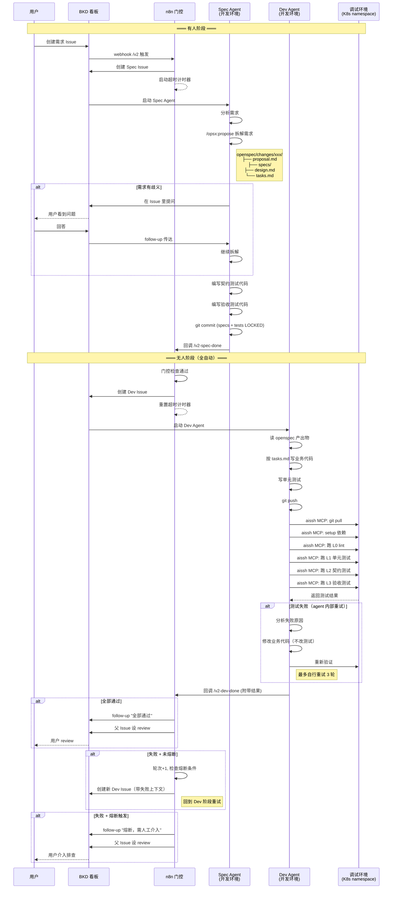
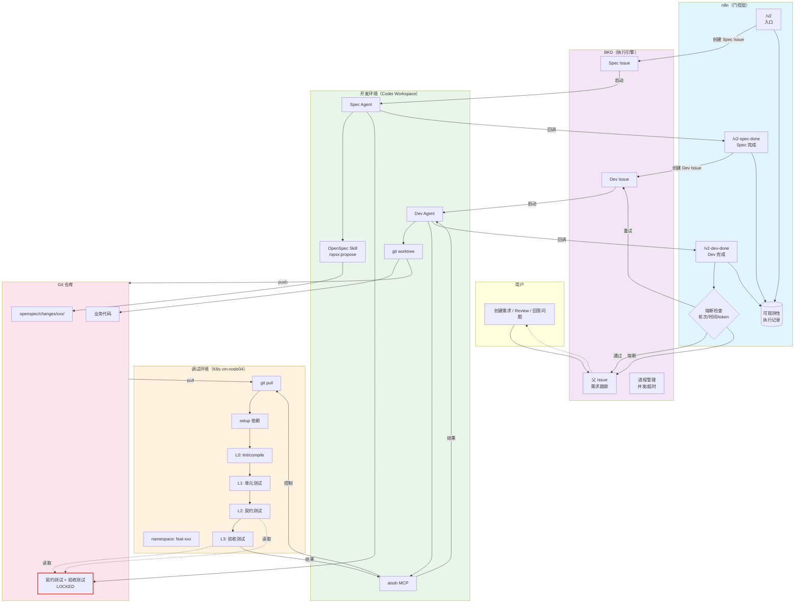

# V3 工作流全景

## 整体协作流程

```mermaid
sequenceDiagram
    participant User as 用户
    participant BKD as BKD 看板
    participant N8N as n8n 门控
    participant Spec as Spec Agent<br/>(开发环境)
    participant Dev as Dev Agent<br/>(开发环境)
    participant Debug as 调试环境<br/>(K8s namespace)

    Note over User,Debug: ═══ 有人阶段 ═══

    User->>BKD: 创建需求 Issue
    BKD->>N8N: webhook /v2 触发
    N8N->>BKD: 创建 Spec Issue
    N8N-->>N8N: 启动超时计时器

    BKD->>Spec: 启动 Spec Agent
    Spec->>Spec: 分析需求
    Spec->>Spec: /opsx:propose 拆解需求
    Note right of Spec: openspec/changes/xxx/<br/>├── proposal.md<br/>├── specs/<br/>├── design.md<br/>└── tasks.md

    alt 需求有歧义
        Spec->>BKD: 在 Issue 里提问
        BKD-->>User: 用户看到问题
        User->>BKD: 回答
        BKD->>Spec: follow-up 传达
        Spec->>Spec: 继续拆解
    end

    Spec->>Spec: 编写契约测试代码
    Spec->>Spec: 编写验收测试代码
    Spec->>Spec: git commit (specs + tests LOCKED)
    Spec->>N8N: 回调 /v2-spec-done

    Note over User,Debug: ═══ 无人阶段（全自动）═══

    N8N->>N8N: 门控检查通过
    N8N->>BKD: 创建 Dev Issue
    N8N-->>N8N: 重置超时计时器

    BKD->>Dev: 启动 Dev Agent
    Dev->>Dev: 读 openspec 产出物
    Dev->>Dev: 按 tasks.md 写业务代码
    Dev->>Dev: 写单元测试
    Dev->>Dev: git push

    Dev->>Debug: aissh MCP: git pull
    Dev->>Debug: aissh MCP: setup 依赖
    Dev->>Debug: aissh MCP: 跑 L0 lint
    Dev->>Debug: aissh MCP: 跑 L1 单元测试
    Dev->>Debug: aissh MCP: 跑 L2 契约测试
    Dev->>Debug: aissh MCP: 跑 L3 验收测试
    Debug-->>Dev: 返回测试结果

    alt 测试失败（agent 内部重试）
        Dev->>Dev: 分析失败原因
        Dev->>Dev: 修改业务代码（不改测试）
        Dev->>Debug: 重新验证
        Note right of Dev: 最多自行重试 3 轮
    end

    Dev->>N8N: 回调 /v2-dev-done (附带结果)

    alt 全部通过
        N8N->>BKD: follow-up "全部通过"
        N8N->>BKD: 父 Issue 设 review
        BKD-->>User: 用户 review
    end

    alt 失败 + 未熔断
        N8N->>N8N: 轮次+1, 检查熔断条件
        N8N->>BKD: 创建新 Dev Issue（带失败上下文）
        Note right of N8N: 回到 Dev 阶段重试
    end

    alt 失败 + 熔断触发
        N8N->>BKD: follow-up "熔断，需人工介入"
        N8N->>BKD: 父 Issue 设 review
        BKD-->>User: 用户介入排查
    end
```

## 系统组件交互

```mermaid
flowchart TB
    subgraph USER["用户"]
        U[创建需求 / Review / 回答问题]
    end

    subgraph N8N["n8n（门控层）"]
        W1["/v2<br/>入口"]
        W2["/v2-spec-done<br/>Spec 完成"]
        W3["/v2-dev-done<br/>Dev 完成"]
        CB{熔断检查<br/>轮次/时间/token}
        OBS[(可观测性<br/>执行记录)]
    end

    subgraph BKD["BKD（执行引擎）"]
        PARENT[父 Issue<br/>需求跟踪]
        SPEC_ISSUE[Spec Issue]
        DEV_ISSUE[Dev Issue]
        PROC[进程管理<br/>并发/超时]
    end

    subgraph DEV_ENV["开发环境（Coder Workspace）"]
        SPEC_AGENT[Spec Agent]
        DEV_AGENT[Dev Agent]
        OPSX[OpenSpec Skill<br/>/opsx:propose]
        AISSH[aissh MCP]
        GIT_LOCAL[git worktree]
    end

    subgraph DEBUG["调试环境（K8s vm-node04）"]
        NS[namespace: feat-xxx]
        GIT_REMOTE[git pull]
        SETUP[setup 依赖]
        L0[L0: lint/compile]
        L1[L1: 单元测试]
        L2[L2: 契约测试]
        L3[L3: 验收测试]
    end

    subgraph REPO["Git 仓库"]
        CODE[业务代码]
        SPECS[openspec/changes/xxx/]
        TESTS[契约测试 + 验收测试<br/>LOCKED]
    end

    %% 用户交互
    U --> PARENT
    PARENT -.-> U

    %% n8n 编排
    W1 -->|创建 Spec Issue| SPEC_ISSUE
    W2 -->|创建 Dev Issue| DEV_ISSUE
    W3 --> CB
    CB -->|通过| PARENT
    CB -->|重试| DEV_ISSUE
    CB -->|熔断| PARENT
    W1 --> OBS
    W2 --> OBS
    W3 --> OBS

    %% BKD 执行
    SPEC_ISSUE -->|启动| SPEC_AGENT
    DEV_ISSUE -->|启动| DEV_AGENT

    %% Spec Agent
    SPEC_AGENT --> OPSX
    OPSX --> SPECS
    SPEC_AGENT --> TESTS
    SPEC_AGENT -->|回调| W2

    %% Dev Agent
    DEV_AGENT --> GIT_LOCAL
    GIT_LOCAL --> CODE
    DEV_AGENT --> AISSH

    %% 跨环境验证
    AISSH -->|控制| GIT_REMOTE
    GIT_REMOTE --> SETUP
    SETUP --> L0 --> L1 --> L2 --> L3
    L2 -.->|读取| TESTS
    L3 -.->|读取| TESTS
    L3 -->|结果| AISSH
    AISSH -->|结果| DEV_AGENT
    DEV_AGENT -->|回调| W3

    %% 代码传输
    GIT_LOCAL -->|push| REPO
    REPO -->|pull| GIT_REMOTE

    style N8N fill:#e1f5fe
    style BKD fill:#f3e5f5
    style DEV_ENV fill:#e8f5e9
    style DEBUG fill:#fff3e0
    style REPO fill:#fce4ec
    style TESTS stroke:#f44336,stroke-width:3px
```

## n8n 工作流细节

```mermaid
flowchart LR
    subgraph V2["/v2 入口"]
        V2_HOOK[Webhook] --> V2_INIT[MCP Init]
        V2_INIT --> V2_CTX[Set Context]
        V2_CTX --> V2_CREATE[Create Spec Issue]
        V2_CREATE --> V2_ID[Extract ID]
        V2_ID --> V2_FU[Follow-up Prompt]
        V2_FU --> V2_START[Update Working]
        V2_START --> V2_CB[Callback 父 Issue]
    end

    subgraph SPEC_DONE["/v2-spec-done"]
        SD_HOOK[Webhook] --> SD_INIT[MCP Init]
        SD_INIT --> SD_CTX[Set Context]
        SD_CTX --> SD_CREATE[Create Dev Issue]
        SD_CREATE --> SD_ID[Extract ID]
        SD_ID --> SD_FU[Follow-up Prompt]
        SD_FU --> SD_START[Update Working]
        SD_START --> SD_CB[Callback 父 Issue]
    end

    subgraph DEV_DONE["/v2-dev-done"]
        DD_HOOK[Webhook] --> DD_INIT[MCP Init]
        DD_INIT --> DD_CTX[Set Context]
        DD_CTX --> DD_EVAL{结果评估}
        DD_EVAL -->|通过| DD_DONE[Callback 完成]
        DD_DONE --> DD_REVIEW[Set Review]
        DD_EVAL -->|失败| DD_FUSE{熔断检查}
        DD_FUSE -->|未触发| SD_CTX
        DD_FUSE -->|触发| DD_ESC[升级人工]
        DD_ESC --> DD_REVIEW
    end

    V2_CB -.->|Agent 完成后回调| SD_HOOK
    SD_CB -.->|Agent 完成后回调| DD_HOOK
```
